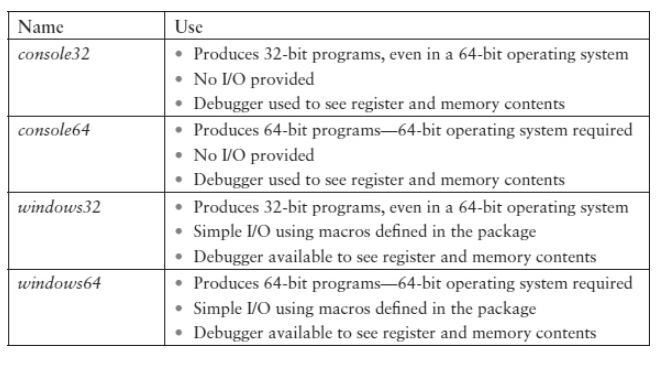

# Complete 32-bit Example Using The Debugger

* This section describes how actually to run the example shown in code block in the Microsoft Visual Studio 2017 environment. 
    * It assumes that you already have Visual Studio 2017 installed on your computer.
    
```asm

.586
.MODEL FLAT

.DATA
number DWORD -105
sum	   DWORD   ?

.CODE
main PROC
	 mov	eax, number
	 add	eax, 158
	 mov	sum, eax

	 mov	eax, 0
	 ret
main ENDP

END
```

* The easiest way to generate a new project is to start with the console32 project folder in the software collection provided for this text.



* Each software package includes four folders: 
    * console32 
    * windows32 
    * console64 
    * windows64

* The packages whose names start with “console” provide a framework for writing assembly language programs that demonstrate how 80x86 instructions work.
    * They have no provision for input or output, but in the Visual Studio environment, the debugger allows you to see how registers and memory are affected by the instructions.
    *  This is all that is required to understand the major objective of this text.

* The packages whose names start with “windows” add the ability to do simple input and output using macros that are described later.
    * These macros expand to instructions that call procedures written in the C programming language. 
    * These C procedures actually do the input or output, but it is not necessary to understand them in order to use the I/O macros.

* Copy the console32 folder to a convenient location on your computer. You may rename the folder to describe the particular project, perhaps example1.

* Do not rename the inner console32 folder even if you renamed the folder that contains it. Double-click console32.sln to start Visual Studio 2017.

* We now want to add our program as a source file. Right-click Source Files, click Add, then New Item .
    * Be sure that Code is selected under Visual C++. Type a name for the file in the Name box. You can choose a different name, but be sure that it ends with the .asm extension. Finally click the Add button. A text editor window named example1.asm opens.

* Copy The source code into the example1.asm text editor window.
 
* You are now ready to execute the program.         

* You are now ready to execute the program. When you drop down the Debug menu in Visual Studio, you see a Start Debugging option, with F5 given as the shortcut key. You can either click on Start Debugging or just press F5 without opening the Debug menu.
    * If you get a message that says “This project is out of date” click Yes to assemble, link, and initiate execution of the program. 

After clicking F5 you will see text indicating progress of the assembly and linking process, and a console window will briefly open and close as the program executes. You will then see “Ready” at the bottom of the window.

* What happened? The answer is that the computer followed our instructions exactly, but the program has no input or output and it executed in an instant. What we need to do now is to slow down program execution and “look inside” the computer to see what is going on as the program executes.

* If necessary, scroll down in the example1.asm code window until the first mov instruction is visible. Click next to this statement in the bar at the left of the window. You will then see a red dot marking a breakpoint, a place at which program execution will halt.    

* Launch program execution by pressing F5. This time you may see the console window, or it may be hidden behind your Visual Studio window. Our program isn’t going to use the console window, but you must not close it since technically the program is a console application. However, you can minimize it to reduce screen clutter. Execution is halted at the breakpoint, at the beginning of our program.

    
    