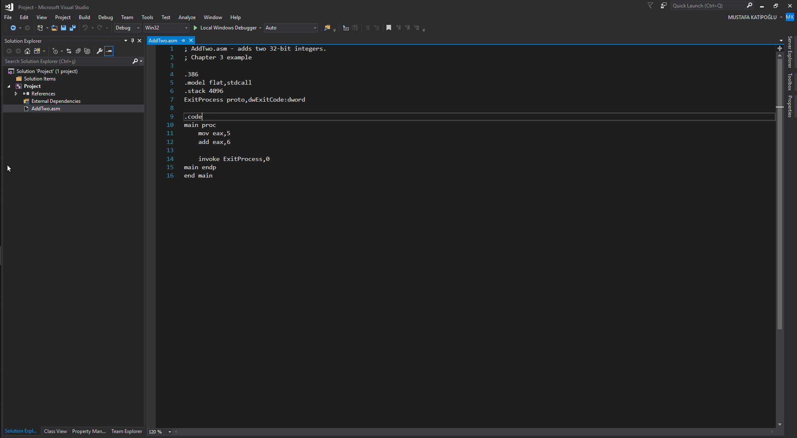
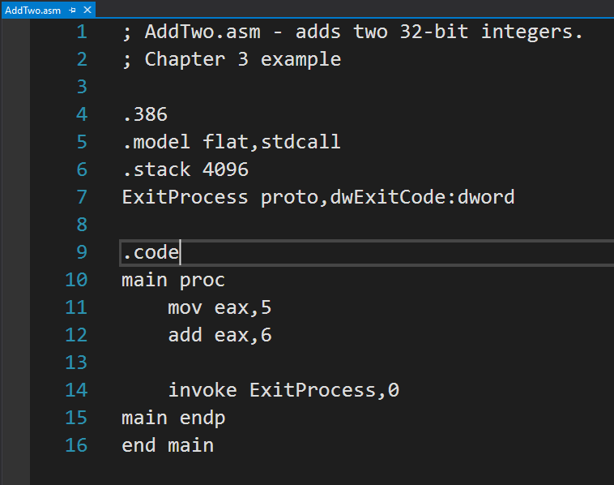
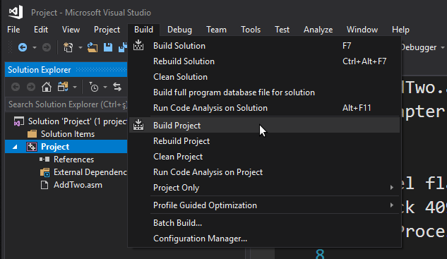
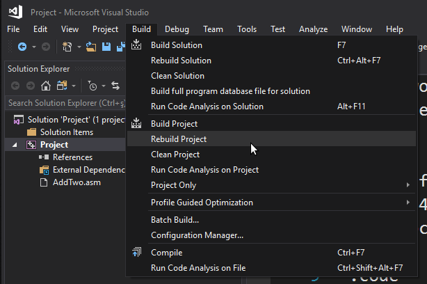

# Setting Up Environment

## Installing Visual Studio 2017 For x86 Assembly

Visual Studio supports multiple programming languages and application types. The C++ programming language configuration most closely matches that of assembly language programming, so we suggest the following steps:

### Download

[Download Visual Studio](https://visualstudio.microsoft.com/tr/vs/)

* First download Visual Studio 2017 community edition or professional edition.
    * Community edition -- Free Version
    * Professional edition -- Paid Version
        * If you are student and have office 365 email like xxx@std.yildiz.edu.tr you can use this edition too.

### Choose the required sections for x86 assembly

* .Net desktop development
* Desktop development with c++
    
    
### Install

* You will have to wait a while for the installation to finish.

### Reboot

* You will have to reboot your computer.


### Validate The Setup

* The Visual C++ language includes the Microsoft Assembler (MASM).

* To validate that MASM was install successfully
    * Open the location that you installed Visual Studio
        * Probably the location is something like this
            * C:\Program Files (x86)\Microsoft Visual Studio\2017\Professional
    * **Search for ml.exe** in the Visual Studio installation directory


## Configure Visual Studio 2017

### Open Visual Studio


* The first time you open Visual Studio, you'll need to select some theme options for IDE.
    * If you don't know what you are doing just leave default options.

### Select Tools > Import And Export Settings


### Select the "Import selected environment settings"


### Select the "No, just import..."


### Select "Visual C++" from the Default Settings List


### Finish The Process


### See The Successful Import Report then Close


## Optional Configuration: Set the tab indent size


## Optional Step: Add the Start Without Debugging command


## Validate Your Environment By Building Your First Project

### Opening a Project

Visual Studio requires assembly language source files to belong to a project, which is a kind of container. A project holds configuration information such as the locations of the assembler, linker, and required libraries. A project has its own folder, and it holds the names and locations of all files belonging to it.

### Download Example Project Files

[Downlad From Here The Example Project](http://kipirvine.com/asm/gettingStartedVS2017/Project32_VS2017.zip)

If the original link doesn't work, you'll find a copy of the project at the [github repository](https://github.com/katipogluMustafa/AssemblyLangTraining/tree/master/00_SettingUpEnvironment).

### Open the Example Project via Visual Studio

Follow these steps:
1. Start Visual Studio.
2. Open [Kip Irvine](http://kipirvine.com)'s sample Visual Studio project file by selecting File/Open/Project from the Visual Studio menu.
3. Navigate to your working folder where you unzipped our project file, and select the file named **Project.sln**.
4. Once the project has been opened, you will see the project name in Visual Studio's Solution Explorer window. You should also see an assembly language source file in the project named AddTwo.asm. Double-click the file name to open it in the editor.

You should see the following:



You should see the following program in the editor window:



In the future, you can use this file as a starting point to create new programs by copying it and renaming the copy in the Solution Explorer window.

### Adding a File to a Project

If you need to add an .asm file to an open project, do the following: 

1. Right-click the project name in the Visual Studio window, select Add, select Existing Item.
2. In the Add Existing Item dialog window, browse to the location of the file you want to add, select the filename, and click the Add button to close the dialog window.


### Build the Program

Now you will build (assemble and link) the sample program. Select **Build Project** from the **Build menu**.



In the Output window for Visual Studio at the bottom of the screen, you should see messages similar to the following, indicating the build progress:


If you do not see these messages, the project has probably not been modified since it was last built. No problem--just select Rebuild Project from the Build menu.



#### Unexpected Error When Building The File

##### Error 1

If you see this message when you build project

```

1>------ Build started: Project: Project, Configuration: Debug Win32 ------
1>C:\Program Files (x86)\Microsoft Visual Studio\2017\Professional\Common7\IDE\VC\VCTargets\Microsoft.Cpp.WindowsSDK.targets(46,5): error MSB8036: The Windows SDK version 10.0.15063.0 was not found. Install the required version of Windows SDK or change the SDK version in the project property pages or by right-clicking the solution and selecting "Retarget solution".
1>Done building project "Project.vcxproj" -- FAILED.
========== Build: 0 succeeded, 1 failed, 0 up-to-date, 0 skipped ==========

```

#### Error 2

If you see this message when you build project

```

1>------ Build started: Project: Project, Configuration: Debug Win32 ------
1>Assembling AddTwo.asm...
1>LINK : fatal error LNK1104: cannot open file 'irvine32.lib'
1>Done building project "Project.vcxproj" -- FAILED.
========== Build: 0 succeeded, 1 failed, 0 up-to-date, 0 skipped ==========

```


## Resources

[Getting Started with MASM and Visual Studio 2017](http://kipirvine.com/asm/gettingStartedVS2017/index.htm)
