# Setting Up Environment

## Installing Visual Studio 2017 For x86 Assembly

Visual Studio supports multiple programming languages and application types. The C++ programming language configuration most closely matches that of assembly language programming, so we suggest the following steps:

### Download

[Download Visual Studio](https://visualstudio.microsoft.com/tr/vs/)

* First download Visual Studio 2017 community edition or professional edition.
    * Community edition -- Free Version
    * Professional edition -- Paid Version
        * If you are student and have office 365 email like xxx@std.yildiz.edu.tr you can use this edition too.

### Choose the required sections for x86 assembly

* .Net desktop development
* Desktop development with c++
    
    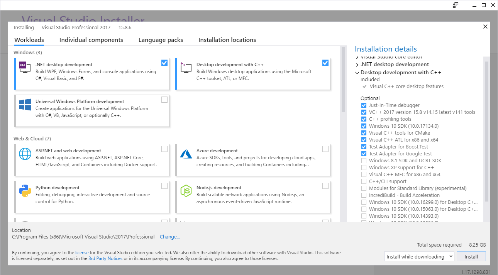
### Install

* You will have to wait a while for the installation to finish.

### Reboot

* You will have to reboot your computer.

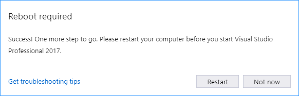

### Validate The Setup

* The Visual C++ language includes the Microsoft Assembler (MASM).

* To validate that MASM was install successfully
    * Open the location that you installed Visual Studio
        * Probably the location is something like this
            * C:\Program Files (x86)\Microsoft Visual Studio\2017\Professional
    * **Search for ml.exe** in the Visual Studio installation directory

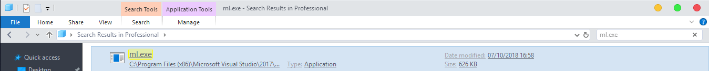

## Configure Visual Studio 2017

### Open Visual Studio

* The first time you open Visual Studio, you'll need to select some theme options for IDE.
    * If you don't know what you are doing just leave default options.

### Select Tools > Import And Export Settings

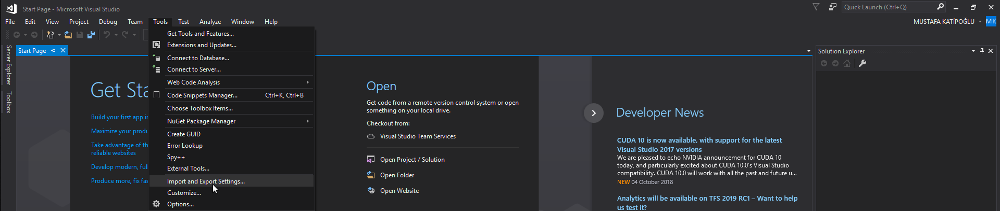

### Select the "Import selected environment settings"

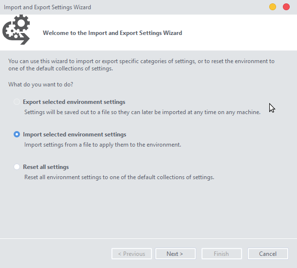

### Select the "No, just import..."

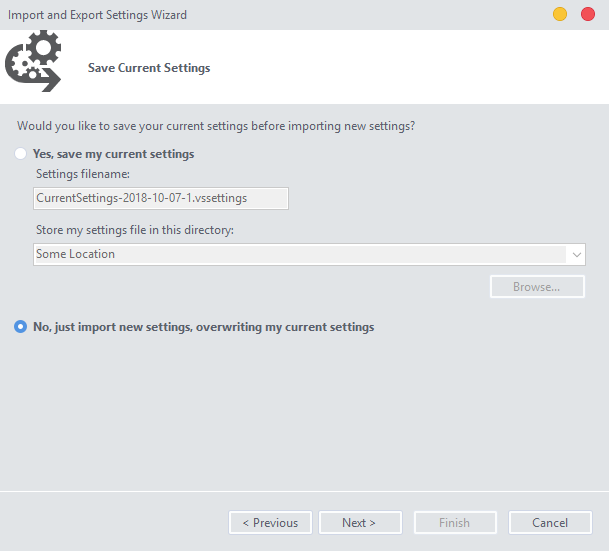

### Select "Visual C++" from the Default Settings List

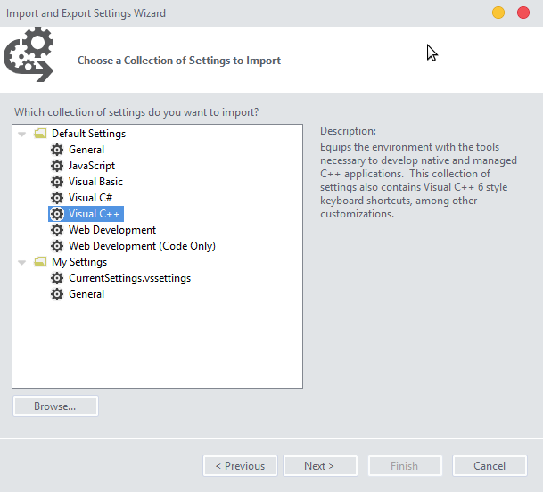

### Finish The Process

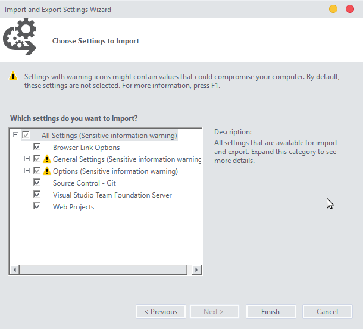

### See The Successful Import Report then Close

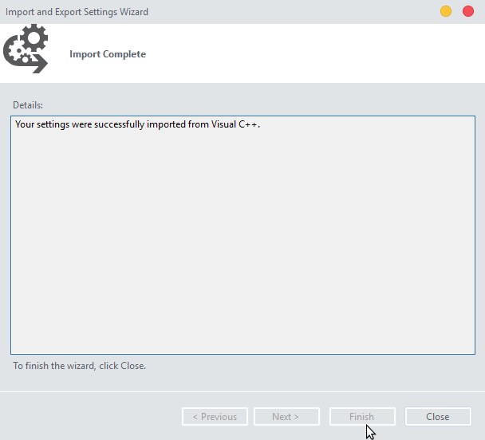

## Optional Configuration: Set the tab indent size

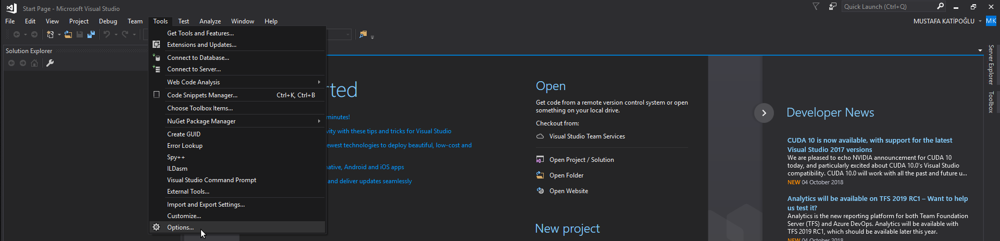

## Optional Step: Add the Start Without Debugging command

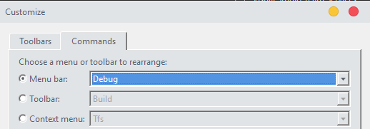

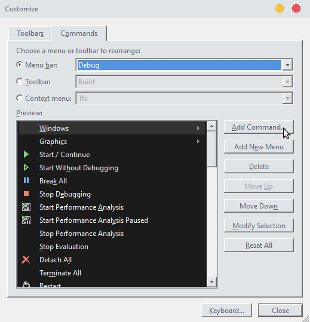

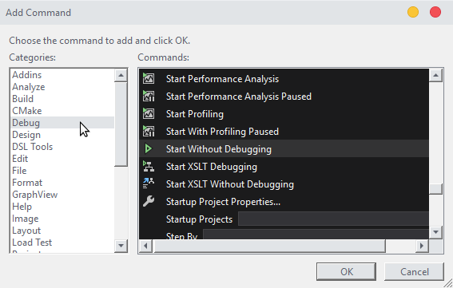

## Validate Your Environment By Building Example

[Complete_32-bit_Example_Using-The-Debugger](Complete_32-bit_Example_Using-The-Debugger)

## Resources

[Getting Started with MASM and Visual Studio 2017](http://kipirvine.com/asm/gettingStartedVS2017/index.htm)
