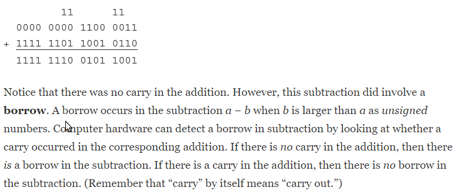

# First Summary

## Representing Data In Computers

For the Intel 80x86 family
* 8 bits, a byte
* 16 bits, a word
* 32 bits, a doubleword
* 64 bits, a quadword

**The 2’s Complement** system allows representation of negative numbers. Numbers will be a fixed length, so that you might refer to the “doubleword-length 2’s complement representation” of a number. 

* If you have 3 digit number, then you subtract the hexadecimal number from 1000.
* Positive numbers written in hex can be identified by a leading hex digit of 0 through 7.
* Negative numbers are distinguished by a leading bit of 1, corresponding to hex digits of 8 through F.

### Integer Addition and Subtraction

* Carry always indicates that the answer is wrong if the operands are interpreted as **unsigned**.

* Overflow occurs when the number of carries into the sign position is different from the number of carries out of the sign position.

### Other Systems for Representing Numbers

* To take the negative of the number, each bit is “complemented”—each zero is changed to one and each one is changed to zero. This operation is sometimes referred to as taking the **1’s complement** of a number.
 
    * There is a useful connection between taking the 1’s complement and taking the 2’s complement of a binary number. If you take the 1’s complement of a number and then add 1, you get the 2’s complement.

* In **binary coded decimal** (**BCD**)schemes, each decimal digit is coded with a string of bits with fixed length(4), and these strings are pieced together to form the representation.
    
    * One BCD representation of the decimal number 926708 is 1001 0010 0110 0111 0000 1000.
    
    * It is not as efficient for a computer to do arithmetic with numbers in a BCD format as with 2’s complement numbers.

* **Floating point** representation systems allow for nonintegers to be represented, or at least closely approximated.  

### How to Convert any number to IEEE single precision floating point number  

## Parts Of Computer System

## Elements Of Assembly Language

## Basic Instructions