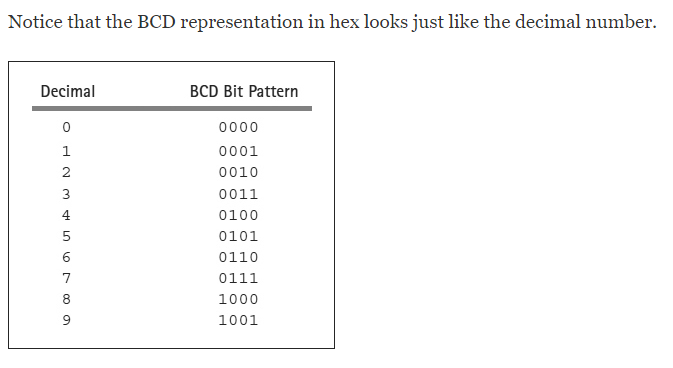
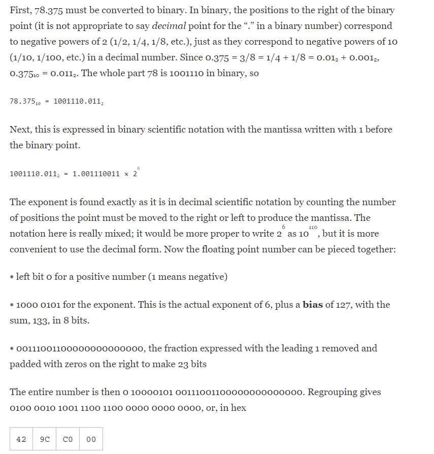

# Representing Data In Computers

## Unsigned and Signed Integers

So far we know how to represent numbers by using ASCII codes or by using binary integers (often expressed in hex). However, there are two problems with these methods: 
 
 1. the number of bits available for representing a number is limited
 2. it is not clear how to represent a negative number.

For the Intel 80x86 family, 8 bits, a byte; 16 bits, a word; 32 bits, a doubleword; and 64 bits, a quadword.

**The 2’s Complement** system allows representation of negative numbers. Numbers will be a fixed length, so that you might refer to the “doubleword-length 2’s complement representation” of a number. 
 
The 2’s complement representation for a non-negative number is, you represent the number in binary with enough leading zeros to fill up the desired length.
    
* For a positive number, the leftmost bit must be zero. This means, for example, that the most positive number that can be represented in word-size 2’s complement form is 01111111111111112 or 7FFF16 or 3276710.  
* The leftmost bit is always 1 in the 2’s complement representation of a negative number.

* You cannot simply change the leading bit from 0 to 1 to get the negative version of a number.

* Positive numbers written in hex can be identified by a leading hex digit of 0 through 7.

* Negative numbers are distinguished by a leading bit of 1, corresponding to hex digits of 8 through F.

## Integer Addition and Subtraction

One of the reasons that the 2’s complement representation scheme is commonly used to store signed integers in computers is that addition and subtraction operations for signed integers are identical to the corresponding operations for unsigned integers. This means that the CPU does not need separate circuitry for signed and unsigned addition or subtraction operations.

Each of the last two additions has a carry out of the usual high-order bit position into an extra bit. The remaining bits do not give the correct unsigned result. In fact, carry always indicates that the answer is wrong if the operands are interpreted as unsigned. Although in these examples the remaining bits gave the correct 2’s complement representation, this is not always the case, even for signed numbers. Consider the addition of the following two positive numbers:

There was no carry out of the high-order bit, but the signed interpretation is plainly incorrect since AC99 represents the negative number −21351. Intuitively what went wrong is that the decimal sum 44185 is bigger than the maximum value 32767 that can be stored in the 2 bytes of a word. (See Exercise 1.3.8.) However, when these numbers are interpreted as unsigned, the sum is correct.

Here is another example showing a “wrong” answer, this time resulting from adding two numbers that are negative in their signed interpretation.

This time there is a carry, but the remaining four hex digits 76EF cannot be the correct signed answer since they represent the positive number 30447. Again, intuition tells you that something had to go wrong because −32768 is the most negative number that can be stored in a word.

* In the previous examples with “incorrect” signed interpretations, **overflow** occurred.

* Computer hardware can detect overflow as it performs addition, and the signed sum will be correct if there is no overflow.

* The computer actually performs addition in binary, of course, and the process is logically a right-to-left pairwise addition of bits, very similar to the procedure that humans use for decimal addition. As the computer adds a pair of bits, sometimes there is a carry (of 1) into the next column to the left. This carry is added to the sum of these 2 bits, and so on. The column of particular interest is the leftmost one, the sign position. There may be a carry into this position and/or a carry out of this position into the “extra” bit. This “carry out” (into the extra bit) is what was called just “carry” earlier and was seen as the extra hex 1.

*  The table can be summarized by saying that overflow occurs when the number of carries into the sign position is different from the number of carries out of the sign position.

### Overflow In Addition

### Overflow In Subtraction

* A computer detects overflow in subtraction by determining whether overflow occurs in the corresponding addition problem.

* If overflow occurs in the addition problem, then it occurs in the original subtraction problem; if it does not occur in the addition, then it does not occur in the original subtraction.

See [Exercises](Exercises/README.md)

## Other Systems for Representing Numbers

The primary reason for introducing 1’s complement, BCD, and floating point here is to illustrate that there are many alternative representations for numeric data, each valid when used in the correct context.

* To take the negative of the number, each bit is “complemented”—each zero is changed to one and each one is changed to zero. This operation is sometimes referred to as taking the 1’s complement of a number. 

There is a useful connection between taking the 1’s complement and taking the 2’s complement of a binary number. If you take the 1’s complement of a number and then add 1, you get the 2’s complement.

In **binary coded decimal** (**BCD**)schemes, each decimal digit is coded with a string of bits with fixed length, and these strings are pieced together to form the representation.

* One BCD representation of the decimal number 926708 is 1001 0010 0110 0111 0000 1000.

It is not as efficient for a computer to do arithmetic with numbers in a BCD format as with 2’s complement numbers. It is usually very inefficient to do arithmetic on numbers represented using ASCII codes. However, ASCII codes are the only method so far for representing a number that is not an integer. For example, 78.375 can be stored as 37 38 2E 33 37 35. **Floating point** representation systems allow for nonintegers to be represented, or at least closely approximated.

#### How to Convert any number to IEEE single precision floating point number
* Example to show how to convert 78.375 to floating point number.
    * Note: If you have negative number the only step that needs to change is that you make the very first bit of your result 1 instead of 0.
    

## Chapter Summary

All data are represented in a computer using electronic signals. These can be interpreted as patterns of binary digits (bits). These bit patterns can be thought of as binary numbers. Numbers can be written in decimal, hexadecimal, or binary forms.

For representing characters, most microcomputers use ASCII codes. One code is assigned for each character, including nonprintable control characters.

Integer values are represented in a predetermined number of bits. An unsigned integer is simply the number in binary. Signed integers are stored in 2’s complement form; a positive number is stored as a binary number (with at least one leading zero to make the required length), and the pattern for a negative number can be obtained by subtracting the positive form from a 1 followed by as many 0’s as are used in the length. A 2’s complement negative number always has a leading 1 bit. 

Addition and subtraction are easy with 2’s complement numbers. Since the length of a 2’s complement number is limited, there is the possibility of a carry, a borrow, or overflow.

Other formats in which numbers are stored are 1’s complement, binary coded decimal (BCD), and floating point.

1. Some early computer systems used byte sizes different from 8 bits.

2. Some other computer architectures use a word size different from 16 bits.
