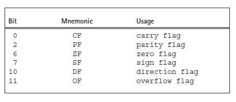
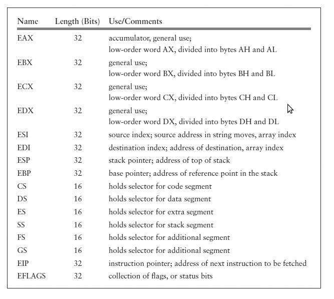
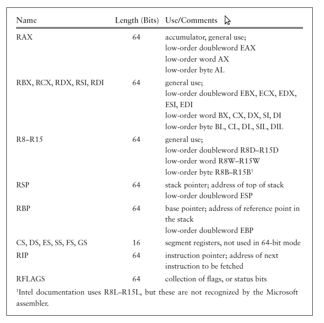

# Parts of a Computer System

A practical computer system consists of hardware and software.

* The major hardware components of a typical microcomputer system are 
    * a central processing unit (CPU)
    * memory circuits
    * a keyboard for input
    * a visual display
    * specialized input/output devices like a mouse or a network card
    * one or more disk drives to store programs and data.

* Software refers to the programs that the hardware executes, including system software and application software.

## PC Hardware: Memory
 
 The memory in a computer is logically a collection of “slots,” each of which can store 1 byte of instructions or data.    
 * Each memory byte has a numeric label called its physical address. 
 * The 32-bit processors such as the Pentium use 32-bit labels, each of which can be expressed as 8 hex digits. The first address is 00000000<sub>16</sub> and the last address can be as large as the unsigned number FFFFFFFF<sub>16</sub>   
 * Since FFFFFFFF<sub>16</sub> = 4,294,967,295, a 32-bit PC can contain up to 4,294,967,296 bytes of memory, or 4 GB.
    * Remember that
        * 2<sup>10</sup> = 1 KB (kilobyte)
        * 2<sup>20</sup> = 1 MB (megabyte)
        * 2<sup>30</sup>= 1 GB (gigabyte)
        * 2<sup>40</sup> = 1 TB (terabyte)
 * Physically a PC’s memory consists of integrated circuits (ICs). Many of these chips provide random access memory (RAM) that can be written to or read from by program instructions. The contents of RAM chips are lost when the computer’s power is turned off. Other ICs are read only memory (ROM) chips that permanently retain their contents, and which can be read from but not written to.
 
 * The assembly language programs in this text use a **flat memory model**. This means that the programs actually encode 32-bit or 64-bit addresses logically to reference locations in a single memory space where data and instructions are stored.
 
 
 
 ## PC Hardware: The CPU
 
 The 8086/8088 CPU can execute over 200 different instructions.Much of this text is concerned with using these instructions to implement programs so that you **understand machine-level computer capabilities**.
 
 This instruction set has been expanded significantly as the 80x86 processor family has grown.
 
 There are other processor families that execute different instruction sets. However, many have a similar architecture, so that the basic principles you learn about 80x86 CPUs also apply to these systems.
 
 ### Registers
 
 An 80x86 CPU contains **registers**, each an internal storage location that **can be accessed much more rapidly** than a location in RAM.
 
  * **The application registers** are of most concern to the programmer.
    * These are the basic program execution registers, as well as floating point registers, MMX, and XMM registers in some of the processors.
    * A 32-bit 80x86 CPU (from 80386 on) has 16 basic program execution registers.
    * Typical instructions transfer data between these registers and memory or perform operations on data stored in the registers or in memory. 
    * All of these registers have names, and some of them have special purposes.
        * Data Registers or General Registers.
            * **EAX**
            * **EBX**
            * **ECX**
            * **EDX**
        * The EAX register is sometimes known as the accumulator because it is the destination for many arithmetic results. An example of an instruction using the EAX register is
          ```asm
          add eax, 158    
          ```
  
  
  
  
  
  
  
  
  
  The 8086 through 80286 processors have four 16-bit general registers called AX, BX, CX, and DX. The “E” was added for “extended” with the 32-bit 80386 registers. The 80386 and later architectures effectively include the original 16-bit architecture.

  * There are four additional 32-bit registers that Intel also calls general registers:
    * You can use these registers for operations like arithmetic, but normally you should save them for their special purposes.
    * **ESI** , “Extended Source Index”
    * **EDI** , "Extended Destination Index"
    * **ESP** , "Extended Stack Pointer"
    * **EBP** , "Extended Base Pointer"
    
  * The **ESI** and **EDI** registers are index registers, where SI stands for “source index” and DI stands for “destination index.”
    * One of their uses is to indicate memory addresses of the source and destination when strings of characters are copied from one place to another in memory. 
    * They can also be used to implement array indexes.
    * The names SI and DI can be used for the low-order words of ESI and EDI, respectively, but we have no occasion to do this.
   * The **ESP** register is the **stack pointer** for the system stack.
        * It is sometimes changed directly by a program, but is more frequently changed automatically when data is pushed onto the stack or popped from the stack.
        *  The address of the instruction following the procedure call instruction is stored on the stack. When it is time to return, this address is retrieved from the stack.
   * The **EBP** register is the **base pointer** register.
        * Normally the only data item accessed in the stack is the one at the top of the stack. However, the EBP register is often used to mark a fixed point in the stack other than the stack top, so that data near this point can be accessed.
        * This is especially important with procedure calls 

#### Segment Registers
            
   * In addition to the eight general-purpose registers 32-bit 80x86 CPUs have six 16-bit **segment registers**:
        * **CS**
        * **DS**
        * **ES**
        * **FS**
        * **GS**
        * **SS** 
 *  In the older 16-bit segmented memory model, the **CS** register contains the segment number of the **code segment** the area of memory storing instructions currently being executed.Since a segment is 64 KB long, the length of a program’s collection of instructions is often limited to 64 KB;a longer program requires that the contents of CS be changed while the program is running. 
 
 * Similarly, **DS** contains the segment number of the **data segment**, the area of memory storing most data.       
 
 * The **SS** register contains the segment number of the **stack segment**, where the stack is maintained. 
 
 * The **ES** register contains the segment number of the **extra data segment** that could have multiple uses.
 
 *  The **FS** and **GS** registers were added with the 80386, and make possible easy access to two additional data segments.
        
 * With the flat 32-bit memory model we use, the segment registers become essentially irrelevant to the programmer.The operating system gives each of CS, DS, ES, and SS values.
    * Recall that each value is a pointer to a table entry that includes the actual starting address of the segment.
    * That table also includes the size of your program, so that the operating system can indicate an error if your program accidentally or deliberately attempts to write in another area.            
 
 * The 32-bit **instruction pointer**, or **EIP** register, cannot be directly accessed by an assembly language programmer.
     * The CPU has to fetch instructions to be executed from memory, and EIP keeps track of the address of the next instruction to be fetched.     
     * An 80x86 CPU actually fetches instructions to be executed later while it is still executing prior instructions, making the assumption (usually correct) that the instructions to be executed next will follow sequentially in memory [**Cache prefetching**]. 
        * If this assumption turns out to be wrong, for example, if a procedure call is executed, then the CPU throws out the instructions it has stored, sets EIP to contain the address of the procedure, and then fetches its next instruction from the new address.   
 
 * In addition to prefetching instructions, an 80x86 CPU actually starts execution of an instruction before it finishes execution of prior instructions. This use of **pipelining** increases effective processor speed.       
 
 #### Flags
 
 * The final register is called the **flags register**. The name **EFLAGS** refers to this register, but this mnemonic is not used in instructions.
    * Some of its 32 bits are used to set some characteristic of the 80x86 processor. 
    * Other bits, called **status flags**, indicate the outcome of execution of an instruction.
    
       
    * Bit 11 is the **overflow flag (OF)**. It is set to 0 following an addition in which no overflow occurred and to 1 if overflow did occur.
    * Bit 0, the **carry flag (CF)**, indicates the absence or presence of a carry out from the sign position after an addition.
    * Bit 7, the **sign flag (SF)**, contains the left bit of the result after some operations. Since the left bit is 0 for a non-negative 2’s complement number and 1 for a negative number, SF indicates the sign.
    * Bit 6, the **zero flag (ZF)**, is set to 1 if the result of an operation is zero, and to 0 if the result is nonzero.
    * Bit 2, the **parity flag (PF)**, is based only on the low-order 8 bits of a result; it is set to 1 if sum of bits are even, set to 0 if sum of bits are odd.
 
 ##### As an example of how flags are set by instructions
 
 ```asm
 add eax, 158
 ```
 
 This instruction affects CF, OF, PF, SF, and ZF.
 
 Suppose that EAX contains the word FF FF FF F3 prior to execution of the instruction. 
 
 Since 158<sub>10</sub> corresponds to the doubleword 00 00 00 9E, this instruction adds FF FF FF F3 and 00 00 00 9E, putting the sum 00 00 00 91 in the EAX register.
 * It sets the carry flag **CF** to **1** since there is a carry
 * the overflow flag **OF** to **0** since there is no overflow
 * the sign flag **SF** to **0** (the leftmost bit of the sum 00 00 00 91)
 * the zero flag **ZF** to **0** since the sum is not zero.
 * The parity flag **PF** is set to **0** since 1001 0001 (the low-order byte 91 in binary) contains three 1 bits, an odd number.

#### Summarized ~ The 32-bit 80x86 application registers




 ### 64-bit Registers
 
 In the evolution of the 80x86 family, just as the 32-bit architecture effectively extended the 16-bit architecture, the 64-bit architecture extends the 32-bit architecture. 
 
 * There are sixteen 64-bit general registers. 
    * The 64-bit register RAX extends the 32-bit register EAX, RBX extends EBX, and so forth. 
    * However, there are eight new 64-bit general registers named R8, R9, R10, R11, R12, R13, R14, and R15. 
        * Just as you can refer to the low-order word of EAX as AX in a 32-bit environment, you can refer to the low-order doubleword of RAX as EAX in a 32-bit environment. 
        * For the new registers R8–R15, you append a D to refer to the low-order doubleword. 
            * For example, R9D refers to the low-order 32 bits of R9. Similarly, R11W refers to the low-order word (16 bits) of R11, and R15B refers to the low-order byte of R15.

---

  Here is an example of an instruction that is legal in a 64-bit program, but not in a 32-bit program:


  
  ```asm
  add rax, r12
  ```
  
  This adds the quadword in R12 to the quadword in RAX, replacing the value in RAX.
 
---

 * Recall that in the 32-bit architecture, you can also access bits 8–16 of EAX, EBX, ECX, and EDX using names AH, BH, CH, and DH, respectively. 
    * These bytes cannot be accessed by name with some 64-bit instructions.
 
 * Index registers ESI and EDI are extended to 64-bit registers RSI and RDI, respectively.
    * Low-order doublewords can be referenced as ESI and EDI.
 * ESP and EBP are extended to 64-bit registers RSP and RBP, respectively. 
 
 * Segment registers have not changed in the 64-bit architecture. However, recall that they are essentially unused when the processor is operating in 64-bit mode.
 
 * In the 64-bit environment, the instruction pointer is the 64-bit register RIP.
 
 * The flags are stored in the 64-bit register RFLAGS.
    * The low-order 32 bits correspond exactly to EFLAGS. Intel documentation says that the high-order 32 bits of RFLAGS are “reserved.”

#### Summarized ~ Basic program execution registers in the 64-bit architecture

        
        
##  PC Hardware: Input/Output Devices

An assembly language programmer has multiple ways to look at I/O devices. 

* At the lowest level, each device uses a collection of addresses or ports in the I/O address space.
    * There are 64-KB port addresses in the 80x86 architecture, and a typical I/O device uses three to eight ports.
        * These addresses are distinct from ordinary memory addresses. The programmer uses instructions that output data or commands to these ports, or input data or status information from them. Such programming is very tedious and the resulting programs are difficult to reuse with different computer systems.
        * Instead of using separate port addresses, a computer system can be designed to use addresses in the regular memory address space for I/O device access. Such a design is said to use **memory-mapped input/output**. Although memory-mapped I/O is possible with the 80x86, **it is not used with most PCs**.
        * Many operating systems, including Windows XP and later Windows versions, **put the CPU in a protected mode** that does **not allow ordinary application programs directly to access I/O ports**. They provide a variety of input and output procedures that are much easier to use than is port-level I/O.           
        
## PC Software

Without software, computer hardware is virtually useless. Software refers to the programs or procedures that are executed by the hardware.

### PC Software: The Operating System

A general-purpose computer system needs an operating system to enable it to run other programs.

 DOS stands for disk operating system.
 
 * The DOS operating systems provide the user a command line interface. 
 
 * Many users prefer a graphical user interface that displays icons representing tasks or files, so that the user can make a selection by clicking on an icon with a mouse. 
 
 ### PC Software: Text Editors
 
 A **text editor** is a program that allows the user to create or modify text files that are stored on secondary storage like a hard disk.
 
 * A text file is a collection of ASCII codes.
 
**Word processors** are text editors that provide extra services for formatting and printing documents.

### PC Software: Language Translators and the Linker

Language translators are programs that translate a programmer’s source code into a form that can be executed by the computer.

* These are usually not provided with an operating system. Language translators can be classified as **interpreters**, **compilers**, or **assemblers**.

* **Interpreters** directly decipher a source program. To execute a program, an interpreter looks at a line of source code and follows the instructions of that line. 
    * Programs written in the Basic or Lisp languages are often executed by an interpreter. 
    * Although the interpreter itself may be a very efficient program, interpreted programs often execute relatively slowly. 
    * An interpreter is generally convenient because it allows a program to be quickly changed and run. 
    * The interpreter itself is sometimes a large program.

* **Compilers** start with source code and produce object code that consists mostly of instructions to be executed by the intended CPU. 
    * High-level languages such as Fortran, Cobol, C, and C++ are commonly compiled. 
    * The object code produced by a compiler must often be linked or combined with other object code to make a program that can be loaded and executed. 
        * This requires a utility called a **linker**, usually provided with a compiler.       * Instead of producing code for a particular CPU, some compilers produce an intermediate code that can be very efficiently interpreted; this is common with **Java** compilers.    

* An **assembler** is used much like a compiler, but it translates assembly language rather than a high-level language into machine code. 
    * The resulting files must normally be linked to prepare them for execution. Because assembly language is closer to machine code than a high-level language, the job of an assembler is somewhat simpler than the job of a compiler. 
    * Assemblers historically existed before compilers.        
    * add eax, 158 is translated by the assembler into the 5 **object code** bytes
        
            05 00 00 00 9E
            
        * The first byte 05 is the op code (operation code) that says to add the number contained in the next 4 bytes to the doubleword already in the EAX register.        
        *  The doubleword 00 00 00 9E is the 2’s complement representation of 158<sub>10</sub>.

* A **debugger** allows a programmer to control execution of a program, stepping through instructions one at a time, or pausing at a preset breakpoint. 
    * the programmer can examine the contents of variables in a high-level language, or registers or memory in assembly language. 
    * A debugger is useful both to find errors and to “see inside” a computer to find out how it executes programs.       

* **Integrated development environments** use a single interface to access an editor, a compiler, an assembler, and a linker.      

## Summary

The CPU executes instructions and uses its internal registers for instruction operands and results, and to determine addresses of data and instructions stored in memory. 

Input/output at the hardware level uses a separate collection of addresses called “ports.” Input/output is usually done through operating systems procedure calls.

An operating system is a vital software component. Through a command line or a graphical user interface, it interprets the user’s requests to carry out commands, or to load and execute programs.

