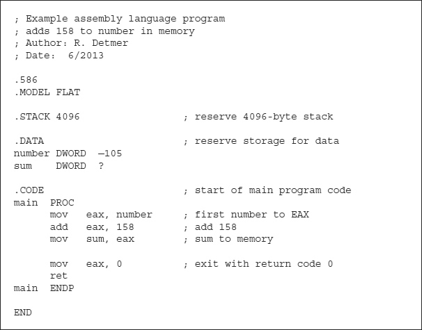
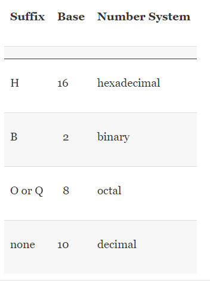

# Elements Of Assembly Language

## Assembly Language Statements

### Statements

* An assembly language source code file consists of a collection of **statements**.
    * Most statements fit easily on an 80-character line, a good limit to observe so that source code can easily be printed or displayed in a window.
    * These can be extended over more than one physical line using backslash (\) characters at the end of each line except the last.

### Comments

* Because assembly language programs are far from self-documenting, it is important to use an adequate number of **comments**. 
    * A comment can be used on any line.    
    * A semicolon (;) begins the comment, and the comment then extends until the end of the line.
    * They are important for the human reader.
    * Comments are ignored by the assembler.



### Statement Types

* There are three types of functional assembly language statements
    * Instructions
    * Directives
    * Macros

#### Instructions

An **instruction** is translated by the assembler into 1 or more bytes of object code (machine code) that is executed at run time.

Each instruction corresponds to one of the operations that the 80x86 CPU can perform.

#### Directive

A directive tells the assembler to take some action.

 Such an action generally does not result in machine instructions and may or may not cause object code to be generated.
 
 #### Examples Of Directive
* The directive ".586" tells the assembler to recognize 80x86 instructions that use 32-bit operands. 
```asm
.586
```

* The directive ".MODEL FLAT" tells the assembler to generate code for flat memory model execution.

```asm
.MODEL FLAT
```

Our example program contains several other directives. 

* The directive ".STACK 4096" tells the assembler to generate a request to the operating system to reserve 4096 bytes for the system stack. The system stack is used at execution time for procedure calls and local storage. A stack containing 4096 bytes is large enough for most programs.

```asm
.STACK 4096
```

* The .DATA directive tells the assembler that data items are about to be defined in a data segment. 

```asm
.DATA
```

* Each DWORD directive tells the assembler to reserve a doubleword of memory for data, the first identified with the label number and initialized to FFFFFF97 (−105<sub>10</sub>), the second identified with the label sum and given the default initial value of 00000000.

```asm
.DATA
number DWORD -105
sum    DWORD   ? 
```

* The .CODE directive tells the assembler that the next statements are executable instructions in a code section. 
    * The PROC directive marks the beginning of a procedure.
    * The ENDP directive the end of a procedure.
        * The END directive on the last line tells the assembler to stop assembling statements. 
    * The label main on the PROC and END directives names the procedure.    
    * In the console32 environment you must call your procedure main.(We'll discuss later)
```asm
.CODE                    ; Start of main program
main PROC
     mov    eax, number  ; first number to EAX
     add    eax, 158     ; add 158
     mov    sum, eax     ; sum to memory 
     
     mov    eax, 0       ; exit with return code 0
     ret
main ENDP
```
---

A **macro** is “shorthand” for a sequence of other statements—instructions, directives, or even other macros.

A statement that is more than just a comment almost always contains a mnemonic that identifies the purpose of the statement, and may have three other fields: name, operand, and comment. 

`name mnemonic operand(s) ; comment`

```asm
zeroCount: mov ecx, 0 ; initialize count to zero
```

* The name field ends with a colon (:) when used with an instruction. 
    * However, when used with a directive, the name field has no colon. 

* The mnemonic in a statement indicates a specific instruction, directive, or macro.

* Some statements have no operand, others have one, others have more. 
    * If there is more than one, operands are separated by commas; spaces can also be added. 
    * Sometimes a single operand has components with spaces between them, making it look like more than one operand.
      
* One use for the name field is symbolically to reference an instruction’s address in memory. Other instructions can then easily refer to the labeled instruction.

* If the add instruction in the sample program needed to be repeatedly executed in a program loop, then it could be coded 
```asm
addLoop: add eax, 158
```

* The instruction can then be the destination of a jmp (jump) instruction, the assembly language version of a goto:
    * Notice that the colon does not appear at the end of the name addLoop in the jmp instruction.
```asm
jmp addLoop ; repeat addition
```

* High-level language loop structures like while or for are not available in machine language. However, they can be implemented using jmp or other instructions.

* It is often useful to have a line of source code consisting of just a name, for example    

```asm
endWhile1:
```    

* Such a label might mark the end of a while loop.
    * Such a label might mark the end of a while loop. Technically it references the address of whatever instruction follows the loop, but you don’t have to know what that next statement is to complete coding of the while loop.

---

* Names and other identifiers used in assembly language are formed from letters, digits, and special characters.
    * The allowable special characters are underscore (_), question mark (?), dollar sign ($), and at sign (@). 
    
* A name may not begin with a digit. An identifier may have up to 247 characters, so that it is easy to form meaningful names.
    *  The assembler does not allow instruction mnemonics, directive mnemonics, register designations, and other words that have a special meaning to the assembler to be used as names.

* **Assembly language statements can be entered using either uppercase or lowercase letters**.            
    * Normally the assembler does not distinguish between uppercase and lowercase.
    * It can be instructed to distinguish within identifiers, but this is only needed when you are linking to a program written in a language that is case-sensitive.

* The assembler accepts code that is almost impossible for a person to read.
    * However, since your programs will also be read by other people, you should make your code as readable as possible. Good program formatting and use of lowercase letters will help.

* Blank lines are allowed in an assembly language source file; they visually separate sections of assembly language code, just like breaking a written narrative into paragraphs.

### Data Declarations

Numeric operands can be expressed in decimal, hexadecimal, binary, or octal notations.

The assembler assumes that a number is decimal unless the number has a suffix indicating another base or a .RADIX directive (not used in this text) changes the default number base.

Any of these suffixes can be coded in uppercase or lowercase. The letter Q is easier to read than O on the rare occasions when you might need to code a constant in octal.



A hexadecimal value must start with a digit. You must, for example, code 0a8h instead of a8h to get a constant with value A8<sub>16</sub>. The assembler will interpret a8h as a name.

```asm

byte0 BYTE 7dh
byte0 BYTE 125
byte0 BYTE 175q
byte0 BYTE '{'

```

```asm

byte1 BYTE 255 ; value is FF
byte2 BYTE 127
byte3 BYTE -25

```

```asm

double1 DWORD 4294967295 ; FFFFFFFF
double2 DWORD 0          ; 00000000
doulbe3 DWORD -1         ; FFFFFFFF

```

```asm
quad1 QWORD -1           ; FFFFFFFFFFFFFFFF 
quad2 QWORD 1000         ; 00000000000003E8
```

* The BYTE directive allows character operands with a single character or string operands with many characters. Either apostrophes (') or quotation marks (") can be used to designate characters or delimit strings. 

```asm
; Each of the following BYTE directives is allowable.

char1 BYTE 'm'  ; Value is 6d
char2 BYTE 6dh  ; Value is 6ds

string1 BYTE "Joe"      ; 4A 6F 65
string2 BYTE "Joe's"    ; 4A 6F 65 27 13
```

* BYTE, WORD, DWORD, and QWORD directives may have multiple operands separated by commas.

```asm

dwords DWORD 10, 20, 30, 40, 50

string1 BYTE "mustafa"
string2 BYTE 'm', 'u', 's', 't', 'a', 'f', 'a'
; string1 and string2 result in the same 7 bytes reserved.
```

* The DUP operator can be used to generate multiple uninitialized values data fields as well as fields with known values.
    *  Its use is limited to BYTE, WORD, DWORD, QWORD, and other directives that reserve storage. 
    
```asm
; Reserve 100 double words of storage, each initialized to 000003E7.
DblArray DWORD 100 DUP(999)

;
stars BYTE 50 DUP('*')
```    

```asm

; If one wants 25 asterisks separated by spaces
starsAndSpaces BYTE 24 DUP("* "), '*' 
; reserves these 49 bytes and assigns the desired initial values.

```

* To reserve space without assigning any particular initial value, use the operand ?.
    * This reserves the appropriate number of bytes for the directive.
    * These bytes are logically undefined; in fact the assembler assigns 00 to each byte.

```asm
; Reserve 100 “undefined” doublewords, each actually containing 00000000
wordArray DWORD DUP (?)
```
