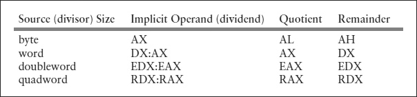

# Division Instructions

* The Intel 80x86 instructions for division mirror those of the single-operand multiplication instructions.

* idiv is for division of signed 2’s complement integers and div is for division of unsigned integers.

* Division instructions start with a double-length dividend and a single-length divisor, and produce a single-length quotient and a single-length remainder.

```asm

div source

idiv source

```

* Operands and results for 80x86 division instructions

    
    
* The source operand identifies the divisor. 

* The divisor can be in a register or memory but not immediate.     

*  If source is byte length, then the double-length dividend is word size
    * It must be in the AX register. 
    
    