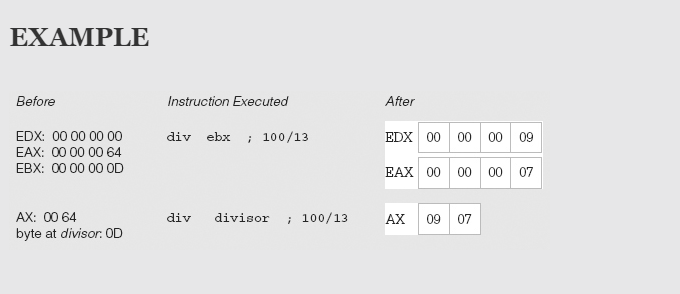
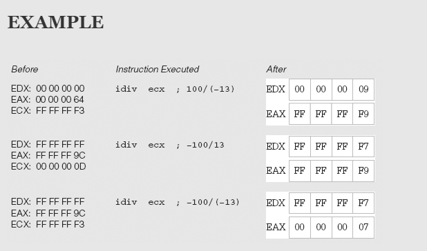
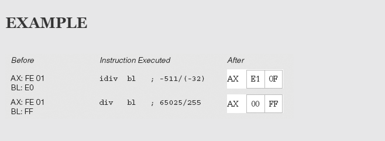
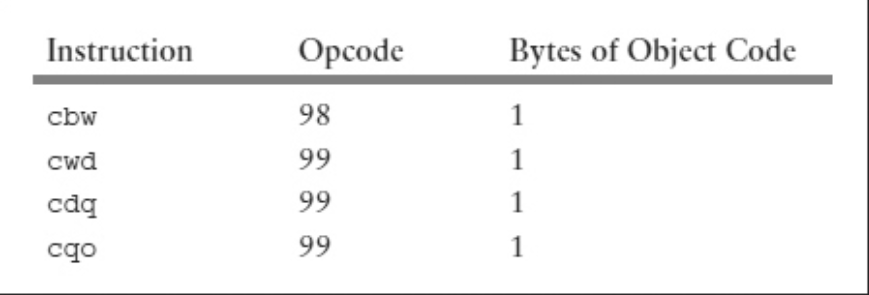
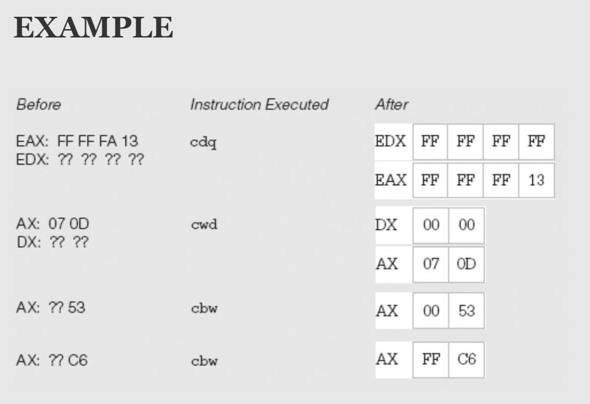

# Division Instructions

* The Intel 80x86 instructions for division mirror those of the single-operand multiplication instructions.

* idiv is for division of signed 2’s complement integers and div is for division of unsigned integers.

* Division instructions start with a double-length dividend and a single-length divisor, and produce a single-length quotient and a single-length remainder.

```asm

div source

idiv source

```

* Operands and results for 80x86 division instructions

    
    
* The source operand identifies the divisor. 

* The divisor can be in a register or memory but not immediate.     

---

*  If source is byte length, then the double-length dividend is word size
    * It must be in the AX register. 

* If source is word length, then the dividend is always the doubleword
    * in DX:AX
    * its high-order 16 bits in the DX register and its low-order 16 bits in the AX register. 

* If source is doubleword length, then the dividend is a quadword (64 bits) 
    * in EDX:EAX
    * its high-order 32 bits in the EDX register and its low-order 32 bits in the EAX register. 

* If source is quadword length, then the dividend is the double quadword (128-bit number) 
    * in RDX:RAX 
    * its high-order 64 bits in the RDX register and its low-order 64 bits in the RAX register.    

---    

* The source operand (the divisor) is not changed by a division instruction.

* For **unsigned div operations** 
    * the dividend, divisor, quotient, and remainder are all treated as nonnegative numbers. 

* For **signed idiv operations**
    * the sign of the quotient is determined by the signs of the dividend and divisor using the ordinary rules of signs; 
    * the sign of the remainder is always the same as the sign of the dividend.    
* Division instructions do not set flags to any meaningful values. They may change previously set values of AF, CF, OF, PF, SF, or ZF flags.







* There can be errors during division. 
    * One obvious cause is an attempt to divide by zero. 
    * A less obvious reason is a quotient that is too large to fit in the single-length destination; 
        * if, say, 0002468A is divided by 0002, the quotient 12345 is too large to fit in the AX register.
    * If an error occurs during the division operation, the 80x86 generates an exception. The routine, or interrupt handler, that services this exception will vary from system to system.    

---
 
* The situation is more complicated for signed division. 

* A positive dividend must be extended with leading 0 bits, but a negative dividend must be extended with leading 1 bits. 

* The 80x86 has instructions specifically for this task. 
    * The `cbw`, `cwd`, `cdq`, and `cqo` instructions which don't have operand.
    
 * The `cbw` instruction always has AL as its source and AX as its destination.
 * `cwd` always has AX as its source and DX:AX as its destination
 * `cdq` always has EAX as its source and EDX:EAX as its destination
 * `cqo` always has RAX as its source and RDX:RAX as its destination. 
 
 * The source register is not changed, but is extended as a signed number into AH, DX, EDX, or RDX. These instructions are summarized together in Figure.    
 
    

    
    