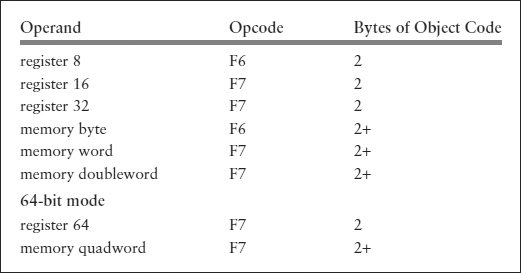
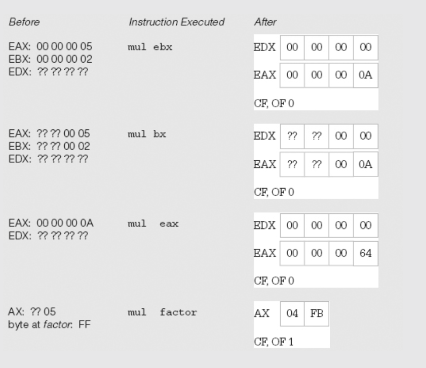
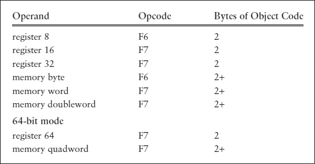
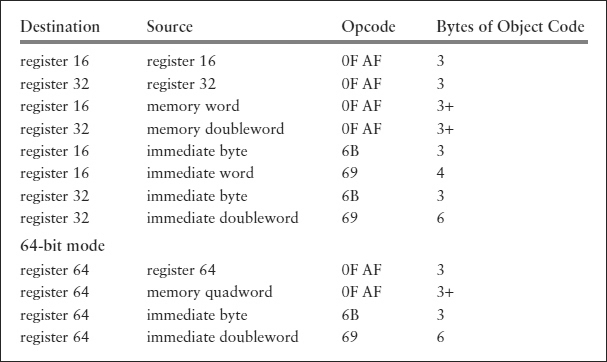
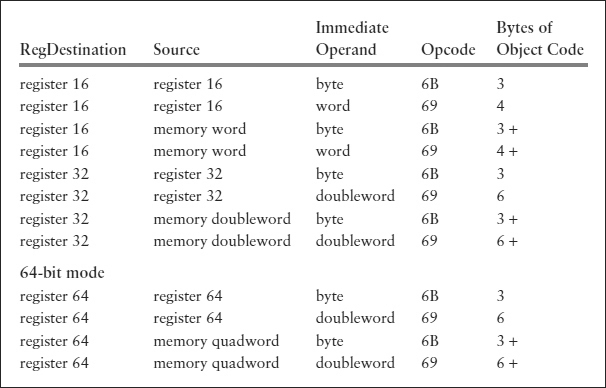

# Multiplication Instructions

* Any `imul` instruction treats its operands as signed numbers.

* A `mul` instruction treats its operands as unsigned binary numbers.

## Unsigned Multiplication

* `mul` takes single operand.
    ```asm
    mul source
    ```
* Source operand can be in a register or in memory, but cannot be immediate.    

* The location of the other number to be multiplied is always the accumulator—AL for a byte source, AX for a word source, EAX for a doubleword source, and RAX for a quadword source.

*If source has byte length, then it is multiplied by the byte in AL; 
    * the product is 16 bits long,
    * destination the AX register. 

* If source has word length, then it is multiplied by the word in AX; 
    * the product is 32 bits long, 
    * its low-order 16 bits going to the AX register and its high-order 16 bits going to the DX register. 
    * This is often written DX:AX.
     
* If source is a doubleword, then it is multiplied by the doubleword in EAX; 
    * the product is 64 bits long, 
    * its low-order 32 bits in the EAX register and its high-order 32 bits in the EDX register
    * written EDX:EAX. 
* If source is a quadword, then it is multiplied by the quadword in RAX; 
    * the product is 128 bits long, 
    * its low-order 64 bits in the RAX register and its high-order 64 bits in the RDX register, 
    * written RDX:RAX. 

* In each case the **source operand is unchanged** unless it is half of the destination location.

    
    
        
    
## Signed Multiplication

 There are three formats, each with a different number of operands.
 
 ### First Syntax
 
 The same as for mul, with source containing one factor and the accumulator the other.
 
 ```asm
 imul source
 ```
 
* As with mul the source operand cannot be immediate.
 
* The destination is AX, DX:AX, EDX:EAX, or RDX:RAX depending on the size of the source operand

* CF and OF are set to 1 if any bit in the high-order half is different from the sign bit in the low-order half. 

*  in object code, reg = 100 for mul and reg = 101 for imul.



 <sub>**imul instructions (single-operand format)**</sub>
 
### Second Syntax

```asm
imul destination register, source
```

* With this format the source operand can be in a register, in memory, or immediate. 
 
 * Register and memory operands must be words, doublewords, or quadwords, not bytes. 
 
* The product must fit in the destination register; if it does, CF and OF are cleared to 0; if not, they are set to 1.
 
 

* Note that some of these instructions have 2-byte-long opcodes. 

* Immediate operands for all size destinations can be a single byte that is sign-extended before multiplication. 

* For word and doubleword operations, an immediate operand can also be a word or doubleword, respectively. 
    * However, for a quadword destination, only byte and doubleword immediate operands are available; either is sign-extended to 64 bits.
    
### Third Syntax

```asm
imul register, source, immediate
```

* With this version, the first operand, a register, is only the destination for the product; 
    * the two factors are the contents of the register or memory location given by source and the immediate value.

* Operands register and source are the same size: 16-bit, 32-bit, or 64-bit. Immediate operands are treated the same as with the two-operand format byte size if small enough, otherwise word or doubleword, in all cases sign-extended to the size of the source operand.

* If the product will fit in the destination register, then CF and OF are cleared to 0; if not, they are set to 1.

    
    
    

