# Basic Instructions

This Section Includes

* Copy data from one location to another
* Instructions used for integer arithmetic
* What types of operands are allowed for the various instructions

You'll learn
* How to copy data between memory and CPU registers, and between two registers
* How to use 80x86 addition, subtraction, multiplication, and division instructions
* How execution of these instructions affects flags
* Some of the details of how the assembler encodes 80x86 instructions for execution.

---
## Copying Data

### mov
Each mov instruction has the form
```asm
mov destination, source
```
and copies a single byte, word, doubleword, or (in 64-bit mode) quadword value from the source operand location to the destination operand location. 

* The value stored at the source location is not changed. 
* The destination location is the same size as the source.
* No mov instruction changes any 80x86 flag.

Java assignment statement
```java 
count = number
```
might correspond directly to the assembly language instruction

```asm
mov count, ecx  ; count := number
; assuming that the ECX register contains the value of number
```

* One limitation of the 80x86 architecture is that not all “logical” combinations of source and destination operands are allowed. 
    * In particular, you cannot have both source and destination in memory.
    *  In fact, no 80x86 instruction encodes two memory operands.
```asm
mov count, number ; illegal for two memory operands
; it is not allowed to have both count and number referencing to memory locations.
```

* In general, an instruction may have one of three effects:
    * No flags are altered
    * Specific flags are given values depending on the results of the instruction
    * Some flags may be altered, but their settings cannot be predicted

* All mov instructions fall in the first category—no mov instruction changes any flag.

* This table(shown below) shows the opcode and the total number of object code bytes for each instruction.
    * Instruction operand formats and object code are the same for 32-bit and 64-bit mode.
 
* mov instructions with byte destination
    
    
    Figure 4.1
    
    * For Instance,
        * ```
          mov   dl, 10   ; object code B2 0A
          ```
        *  the instruction has the decimal value 10 stored as the byte-size hex value 0A. The opcode code and immediate value complete the 2 bytes of object code promised in the last column of the table.  
        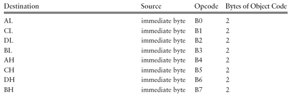
---
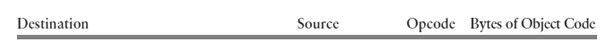 
 
* Look at the row of the table where the source and destination both say register 8. This row actually stands for mov instructions with 64 possible operand combinations—any of AL, AH, BL, BH, CL, CH, DL, or DH for the source or for the destination. The opcode for any of these possibilities is always 8A, and the second object code byte identifies the registers.
    
    * This byte, which Intel documentation refers to as the **ModR/M** byte, has many uses in encoding instructions.
    
    *  The **ModR/M** byte always has three fields, 
        * The first of which is a 2-bit Mod (“mode”) field in bits 7 and 6. 
        * The other two fields are each 3 bits long, and these fields have different meanings in different instructions. 
            * However, for instructions with two register operands, Mod=11 and the next field (called Reg for “register”) in bits 5, 4, and 3 encodes the destination, 
            * While the final field (called R/M for “register/memory”) in bits 2, 1, and 0 encodes the source register.
    * The 8-bit register encodings used are shown below
    
    
    
    *   
        ```asm
        mov ch, bl ; 8A EB
        ```
        * where the ModR/M byte EB is pieced together from 11 101 011; 
        * 11 for register to register
        * 101 for CH
        * 011 for BL.  
         
---

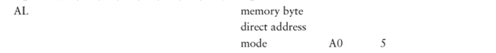
* Next rows of the table have a register destination and a memory source. 
* The accumulator is still the register of choice because the object code is sometimes slightly more compact (takes fewer bytes) when the accumulator is used. AL is the 8-bit accumulator, and because it takes 5 bytes of object code instead of 6 to use the A0 opcode, this is the choice that the assembler makes for destination AL and memory direct source.

* As an example, suppose that memByte references a byte in memory.
    * Then the opcode for will be A0.
        ```asm
        mov al, memByte
        ```   
    * In 32-bit systems, the remaining 4 bytes are the address in memory of memByte.
    
    * In 64-bit systems, the remaining 4 bytes are the displacement from RIP to the address of memByte.
---
* Consider the instruction mov bl, memByte.    


    * ```asm
          mov BL, memByte
      ```
    * Since BL is not the accumulator
        * the opcode is 8A 
        * the number of object code bytes is “2+”
        * This notation means that there are at least 2 bytes of object code, but the number depends on the mode of the memory operand.
        * The second byte of object code is a ModR/M byte.Direct memory addressing is always encoded with Mod=00 and R/M=101, while the Reg field encodes the destination 011 (for BL) in this example. This makes the Mod/R/M byte 1D (00 011 101).
        * The source address for memByte takes 4 additional bytes. With **direct memory mode**, “2+” always means “2+4,” so that the actual number of bytes of object code is 6.

* However, for register indirect mode (the only other 32-bit memory addressing mode we have covered so far), Mod=00, Reg encodes the destination, and R/M encodes the register used as the “pointer.”
    *  The list shows additional register encodings for 32-bit and 16-bit registers.    
    
            
         
* As an example;
    ```asm
    mov AL, [ebx]
    ```        
    * The accumulator AL is not special except for direct memory addressing, so the opcode will be 8A 
    * The ModR/M byte will consist of Mod=00 for register indirect memory addressing
    *  Reg=000 for AL
    * R/M= 011 for EBX
    *  making 00 000 011 or 03
    * In general, for register **indirect mode**, “2+” means “2+0” or just 2.
---


* Continuing down Figure 4.1, the next row is for **immediate**-to-**memory** moves.    
    * Each of these instructions has 
        * opcode C6
        * a ModR/M byte
        * additional address bytes (if needed)
        * finally a byte containing the immediate operand.
    * For example, smallCounter references a byte in memory and the instruction
        ```asm
        mov smallCounter 100
        ```
        The assembler will generate 7 (3+4) bytes of object code, 
        
        `C6 05 xx xx xx xx 64`
        
        where xx xx xx xx represents the address in memory, 64 is the byte-size hex version of 100.
        *  The ModR/M byte 05 is 00 000 101
            * Mod=00 
            * With the Reg field not needed and set to 000.
            * R/M=101 for direct memory addressing
    * As another example, consider the code below with the memory destination using register indirect mode.
        ```asm 
        mov BYTE PTR [edx], -1 ;C6 02 FF
        ```    
       * The opcode is still C6 and the immediate byte (which always comes last) is now FF for −1.  
        * The second byte is the ModR/M byte with Mod=00 for register indirect, Reg=000 (unused), and R/M=010 for EDX, making 00 000 010 or 02. The object code is therefore C6 02 FF.
---

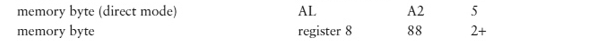
* The next two rows of Figure 4.1 are for register-to-memory mov instructions. These are encoded just like the memory-to-register mov instructions, but with different opcodes for different directions. Again, there is a special, slightly more compact version for use when AL is the source and direct memory addressing is used for the destination.   
---   
Finally we come to the instructions in Figure 4.1 that work only with a 64-bit processor.


These are very similar to the instructions above, except that the opcode is preceded by an extra byte, here 41, 44, or 45, shown in italics because **technically it is not part of the opcode**.

 In 64-bit mode, this byte is a **REX prefix**.
 *  It is used only when the instruction uses one of the 64-bit registers or uses a 64-bit operand.
 * The first 4 bits of any REX prefix are always 0100 (4<sub>16</sub>).
 
Recall that there are 16 general registers in a 64-bit 80x86 processor, but the Reg and R/M fields of the ModR/M byte each contain 3 bits, only enough to encode eight different registers.

Bit 2 of the REX prefix is combined with the 3 Reg bits in the ModR/M byte, making 4 bits to encode 16 register possibilities. 

Similarly, bit 0 of the REX prefix is appended as the high-order bit of the R/M field to give 16 possibilities there, too. The idea is simple, but the details are messy, so we will not attempt to assemble 64-bit instructions by hand.

One thing to note is that AH, BH, CH, and DH may not be used in combination with R8B–R15B. There are 16 8-bit registers when you count these 12 plus AL, BL, CL, and DL, but the machine code designers chose to make DIL, SIL, BPL, and SPL available for 8-bit operations instead of AH, BH, CH, and DH. We have no occasion to code instructions with DIL, SIL, BPL, or SPL operands.

---

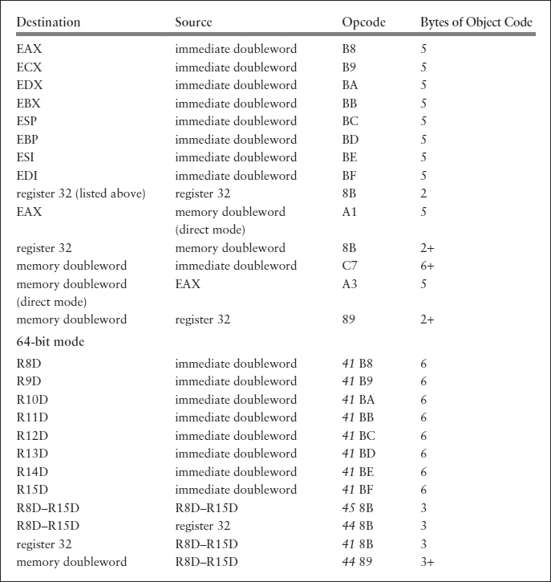

Figure 4.4 : mov instructions with doubleword destination


Each instruction in Figure 4.4 has a doubleword destination. They are very similar to the byte-destination instructions in Figure 4.1.

 The opcodes are different, and the instructions with immediate operands have more bytes of object code because a 4-byte immediate value rather than a 1-byte immediate value is assembled into the instruction.
 
 * First,
    ```asm
    mov edx, 1000
    ```
    opcode BA and the remaining bytes of the object code will be 000003E8, 1000 as a doubleword integer.
 
 * Next, if dblOp references a doubleword in memory, 
     ```asm
     mov eax, dblOp
     ```
     will have 5 bytes of object code, the opcode A1 followed by the 32-bit address of dblOp.
 
 * Finally,
    ```asm
    mov dblOp, esi
    ```
    will have 6 bytes of object code,
    * The opcode 89
    * The ModR/M byte, 4 bytes for the address of dblOp. 
    * The ModR/M byte will have 
        * mod=00 and R/M=101, the combination always used for direct memory addressing,
        * reg=110 for ESI, combined to give 00 110 101(35<sub>16</sub>). 
        
           
        
        Figure 4.3
    * This makes the object code 89 35 xx xx xx xx, where the x’s stand for the address bytes.
---
Figure 4.5 : mov instructions with word destination

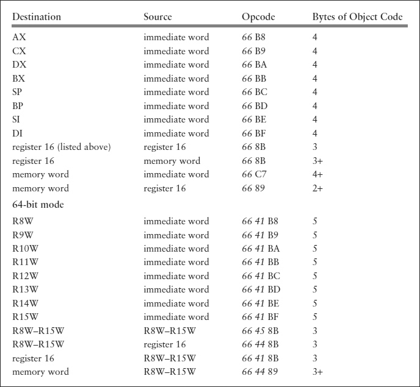

This table is very similar to Figure 4.4, the major difference being a new prefix byte in front of each opcode.

Instructions for 32-bit and 16-bit operands actually have the same opcodes.

A 32-bit 80x86 processor maintains a segment descriptor for each active segment.

* One bit of this descriptor determines whether operands are 16-bit or 32-bit length by default. 
    
    *  With the assembly and linking options used in this text, this bit is set to 1 to indicate 32-bit operands. Therefore, the B8 opcode means, for instance, to copy the immediate doubleword following the opcode to EAX, not an immediate word to AX.
    
    *  If you code a 16-bit instruction, then the assembler inserts the prefix byte 66 in front of the object code. 
        * In general, the prefix byte 66 tells the assembler to switch from the default operand size (32 bit or 16 bit) to the alternative size (16 bit or 32 bit) for the single instruction that follows the prefix byte.
        
* To make this clearer, suppose you assemble a program containing the following three instructions.    
    ```asm
    mov AL, 155
    mov ax, 155
    mov eax, 155
    ```
    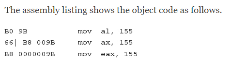    
    * Recall that an immediate operand is actually assembled into the object code. 
        * Each of these instructions contains 155 converted to binary in the appropriate length, 
            * 9B in the first instruction, 
            * 009B in the second,
            * and 0000009B in the third.
    *  The first instruction has opcode B0, but both of the other instructions have opcode B8. 
    
    * The 66 byte shown in the second instruction is the prefix byte that tells the assembler to switch from 32-bit operand size to 16 bit for this instruction.
    
A 64-bit 80x86 processor runs in either legacy 32-bit mode, exactly as described previously, or in 64-bit mode.

Different code segments can be in different modes at the same time. In 64-bit mode, the default operand size is still 32 bits.

---

Figure 4.6 : mov instructions with quadword destination     
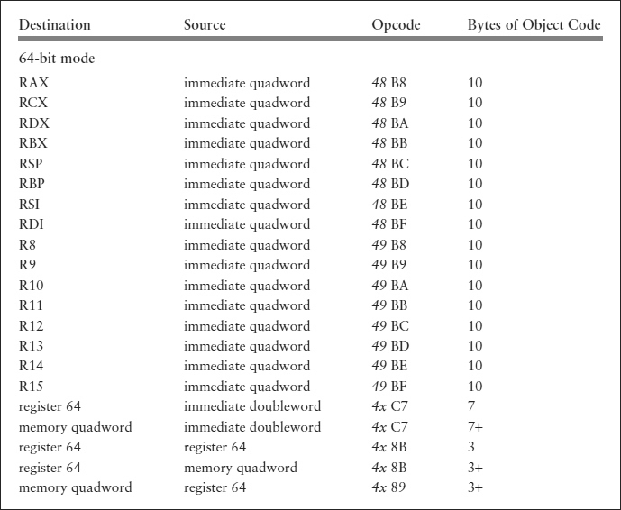    

Figure 4.6 shows the mov instructions with a quadword destination. Obviously these are only available in 64-bit processors. 

---
The first 16 rows are not surprising, showing separate instructions for loading a 64-bit immediate operand in a 64-bit register.

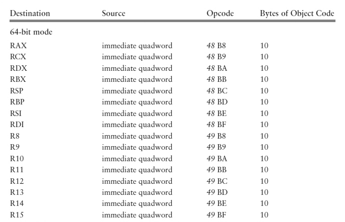

Each consists only of a REX prefix, the opcode, and the 8 bytes of the immediate operand. 

---

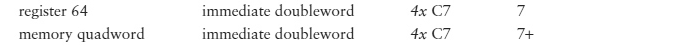

The next two rows show a feature that we have not seen in previous instructions; the immediate value stored in the instruction is a doubleword even though the destination is a quadword. 

Storing a doubleword saves 4 bytes of object code. The immediate doubleword is sign-extended to a quadword as it is stored in the destination, that is, the sign bit (bit 31) in the source is copied to each of bits 32–63 in the destination.

* This ensures that 2’s complement signed numbers are properly represented, but in rare instances could cause a large unsigned number to be incorrectly extended to 64 bits. 

---
* The REX prefix for each of the last five rows is shown as 4x since there is more than one possible value in each row.


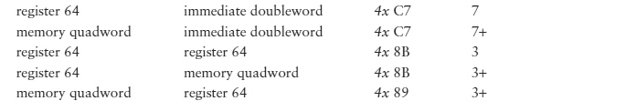

Particularly with older processors, instructions that access memory are slower than instructions that use data in registers. 
* A programmer should plan to keep frequently used data in registers when possible.

---

When you first look at all the mov instructions in Figures 4.1, 4.4, 4.5, and 4.6 you may think that you can use them to copy any source value to any destination location. 

However, there are many seemingly logical combinations that are not available. These include:

* A move with both source and destination in memory

* Any move where the operands are not the same size

* A move of several objects

**You may need to do some of these operations**. We describe next how to accomplish some of them.
 
---

 Although there is no mov instruction to copy from a memory source to a memory destination, two moves using an intermediate register can do the job. 
 
 For doubleword-length data in memory referenced by count and number, the illegal instruction
 ```asm
 mov count, number   ; illegal for two memory operands
 ```
 can be replaced by
 ```asm
mov eax, number      
mov count, eax       ; count := number
 ```
 
 each using the accumulator EAX and one direct memory operand. 
 
* Some register other than EAX could be used, but each of these instructions using the accumulator requires 5 bytes, while each of the corresponding instructions using some other register takes 6 bytes—EAX is chosen in the interest of compact code.

---

Suppose you have numeric data stored in a doubleword at dblSize, but you want the byte-size version at byteSize. Assuming that the high-order 24 bits are not significant, you can do this with

```asm
mov EAX, dblSize
mov byteSize, AL
```

Going the other way, if an unsigned or positive value is stored at byteSize and we want the doubleword equivalent at dblSize, then

 ```asm
 mov eax, 0
 mov al, byteSize
 mov dblSize, eax
 ```
 
 does the job.
 
### xchg
 
 Suppose that you have source and destination locations declared as
 
 ```asm
 source     DWORD 4 DUP(?)
 dest       DWORD 4 DUP(?)
 ```
 
 and that you want to copy all four doublewords from the source to the destination.
 
 * One way to do this is with eight instructions
 ```asm
 mov eax, source        ; copy the first double word
 mov dest, eax
 
 mov eax, source+4      ; copy the second double word
 mov dest+4, eax
 
 mov eax, source+8      ; copy the third double word
 mov dest+8, eax
 
 mov eax, source+12     ; copy the fourth double word
 mov dest+12, eax
 ```
An address like source+4 refers to the location 4 bytes (one doubleword) after the address of source. 

Since the four doublewords reserved at source are contiguous in memory, source+4 refers to the second doubleword. This code clearly would not be space efficient if you needed to copy 40 or 400 doublewords.In Chapter 5 you will learn how to set up a loop to copy multiple objects.

---

The 80x86 has a very useful `xchg` instruction that exchanges data in one location with data in another location. It accomplishes in a single instruction the operation that often requires three high-level language instructions. 

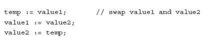

If value1 is stored in the EAX register and value2 is stored in EBX, we might use ECX for temp and directly implement this design with

```asm
mov ecx, eax    ; swap value1 and value2
mov eax, ebx
mov ebx, ecx
```

The xchg instruction makes the code shorter and clearer.

```asm
xchg eax, ebx   ; swap value1 and value2
```

---

Figure 4.7 lists the various forms of the xchg instruction.

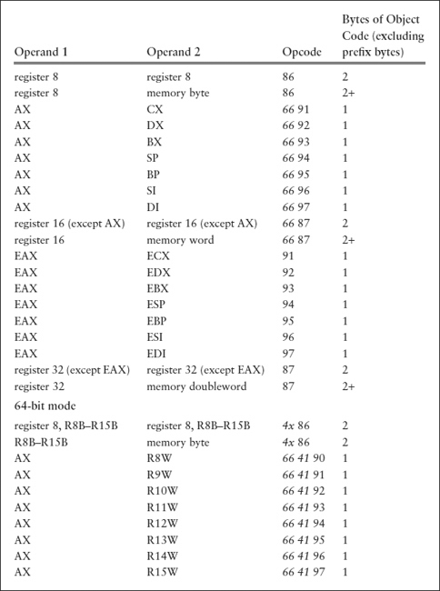
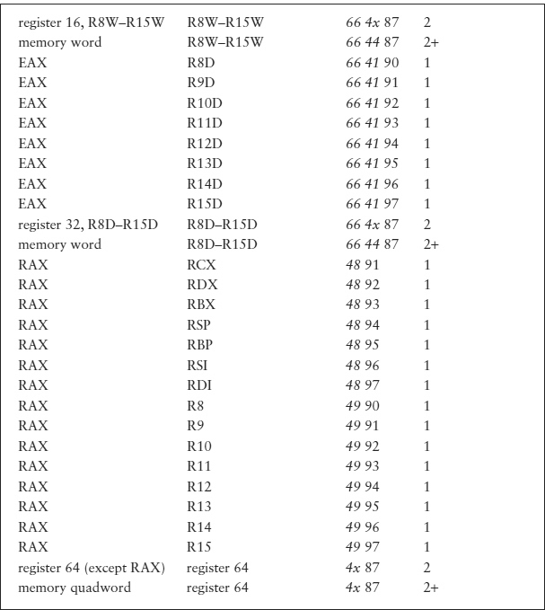

* Although the table does not show it, 
    * The first operand can be a memory operand when the second operand is a register; 
    * The assembler effectively reverses the order of the operands and uses the form shown in the table.
* The `xchg` instructions illustrate again that the accumulator sometimes plays a special role in a computer’s architecture.
    * The instructions that swap another register with the accumulator take 1 byte (plus prefix bytes) instead of 2. 

* Notice again that the word, doubleword, and quadword instructions are the same except for prefix bytes.

* Note that you cannot use an xchg instruction to swap two memory operands.
    * In general, 80x86 instructions do not allow two memory operands to be encoded.

* Like `mov` instructions, `xchg` instructions do not alter any status flag.    
    * That is, after execution of an xchg instruction, the bits of the flags register remain the same as before execution of the instruction.
   
## Integer Addition and Subtraction Instructions

