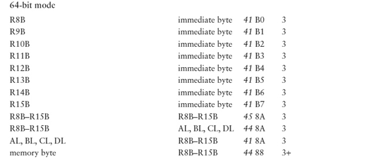

# Basic Instructions

This Section Includes

* Copy data from one location to another
* Instructions used for integer arithmetic
* What types of operands are allowed for the various instructions

You'll learn
* How to copy data between memory and CPU registers, and between two registers
* How to use 80x86 addition, subtraction, multiplication, and division instructions
* How execution of these instructions affects flags
* Some of the details of how the assembler encodes 80x86 instructions for execution.

---

## mov
Each mov instruction has the form
```asm
mov destination, source
```
and copies a single byte, word, doubleword, or (in 64-bit mode) quadword value from the source operand location to the destination operand location. 

* The value stored at the source location is not changed. 
* The destination location is the same size as the source.
* No mov instruction changes any 80x86 flag.

Java assignment statement
```java 
count = number
```
might correspond directly to the assembly language instruction

```asm
mov count, ecx  ; count := number
; assuming that the ECX register contains the value of number
```

* One limitation of the 80x86 architecture is that not all “logical” combinations of source and destination operands are allowed. 
    * In particular, you cannot have both source and destination in memory.
    *  In fact, no 80x86 instruction encodes two memory operands.
```asm
mov count, number ; illegal for two memory operands
; it is not allowed to have both count and number referencing to memory locations.
```

* In general, an instruction may have one of three effects:
    * No flags are altered
    * Specific flags are given values depending on the results of the instruction
    * Some flags may be altered, but their settings cannot be predicted

* All mov instructions fall in the first category—no mov instruction changes any flag.

* This table(shown below) shows the opcode and the total number of object code bytes for each instruction.
    * Instruction operand formats and object code are the same for 32-bit and 64-bit mode.
 
* mov instructions with byte destination
    
    
    Figure 4.1
    
    * For Instance,
        * ```
          mov   dl, 10   ; object code B2 0A
          ```
        *  the instruction has the decimal value 10 stored as the byte-size hex value 0A. The opcode code and immediate value complete the 2 bytes of object code promised in the last column of the table.  
        
---
 
 
* Look at the row of the table where the source and destination both say register 8. This row actually stands for mov instructions with 64 possible operand combinations—any of AL, AH, BL, BH, CL, CH, DL, or DH for the source or for the destination. The opcode for any of these possibilities is always 8A, and the second object code byte identifies the registers.
    
    * This byte, which Intel documentation refers to as the **ModR/M** byte, has many uses in encoding instructions.
    
    *  The **ModR/M** byte always has three fields, 
        * The first of which is a 2-bit Mod (“mode”) field in bits 7 and 6. 
        * The other two fields are each 3 bits long, and these fields have different meanings in different instructions. 
            * However, for instructions with two register operands, Mod=11 and the next field (called Reg for “register”) in bits 5, 4, and 3 encodes the destination, 
            * While the final field (called R/M for “register/memory”) in bits 2, 1, and 0 encodes the source register.
    * The 8-bit register encodings used are shown below
    
    
    
    *   
        ```asm
        mov ch, bl ; 8A EB
        ```
        * where the ModR/M byte EB is pieced together from 11 101 011; 
        * 11 for register to register
        * 101 for CH
        * 011 for BL.  
         
---


* Next rows of the table have a register destination and a memory source. 
* The accumulator is still the register of choice because the object code is sometimes slightly more compact (takes fewer bytes) when the accumulator is used. AL is the 8-bit accumulator, and because it takes 5 bytes of object code instead of 6 to use the A0 opcode, this is the choice that the assembler makes for destination AL and memory direct source.

* As an example, suppose that memByte references a byte in memory.
    * Then the opcode for will be A0.
        ```asm
        mov al, memByte
        ```   
    * In 32-bit systems, the remaining 4 bytes are the address in memory of memByte.
    
    * In 64-bit systems, the remaining 4 bytes are the displacement from RIP to the address of memByte.
---
* Consider the instruction mov bl, memByte.    


    * ```asm
          mov BL, memByte
      ```
    * Since BL is not the accumulator
        * the opcode is 8A 
        * the number of object code bytes is “2+”
        * This notation means that there are at least 2 bytes of object code, but the number depends on the mode of the memory operand.
        * The second byte of object code is a ModR/M byte.Direct memory addressing is always encoded with Mod=00 and R/M=101, while the Reg field encodes the destination 011 (for BL) in this example. This makes the Mod/R/M byte 1D (00 011 101).
        * The source address for memByte takes 4 additional bytes. With **direct memory mode**, “2+” always means “2+4,” so that the actual number of bytes of object code is 6.

* However, for register indirect mode (the only other 32-bit memory addressing mode we have covered so far), Mod=00, Reg encodes the destination, and R/M encodes the register used as the “pointer.”
    *  The list shows additional register encodings for 32-bit and 16-bit registers.    
    
            
         
* As an example;
    ```asm
    mov AL, [ebx]
    ```        
    * The accumulator AL is not special except for direct memory addressing, so the opcode will be 8A 
    * The ModR/M byte will consist of Mod=00 for register indirect memory addressing
    *  Reg=000 for AL
    * R/M= 011 for EBX
    *  making 00 000 011 or 03
    * In general, for register **indirect mode**, “2+” means “2+0” or just 2.
---


* Continuing down Figure 4.1, the next row is for **immediate**-to-**memory** moves.    
    * Each of these instructions has 
        * opcode C6
        * a ModR/M byte
        * additional address bytes (if needed)
        * finally a byte containing the immediate operand.
    * For example, smallCounter references a byte in memory and the instruction
        ```asm
        mov smallCounter 100
        ```
        The assembler will generate 7 (3+4) bytes of object code, 
        
        `C6 05 xx xx xx xx 64`
        
        where xx xx xx xx represents the address in memory, 64 is the byte-size hex version of 100.
        *  The ModR/M byte 05 is 00 000 101
            * Mod=00 
            * With the Reg field not needed and set to 000.
            * R/M=101 for direct memory addressing
    * As another example, consider the code below with the memory destination using register indirect mode.
        ```asm 
        mov BYTE PTR [edx], -1 ;C6 02 FF
        ```    
       * The opcode is still C6 and the immediate byte (which always comes last) is now FF for −1.  
        * The second byte is the ModR/M byte with Mod=00 for register indirect, Reg=000 (unused), and R/M=010 for EDX, making 00 000 010 or 02. The object code is therefore C6 02 FF.
---


* The next two rows of Figure 4.1 are for register-to-memory mov instructions. These are encoded just like the memory-to-register mov instructions, but with different opcodes for different directions. Again, there is a special, slightly more compact version for use when AL is the source and direct memory addressing is used for the destination.   
---   
Finally we come to the instructions in Figure 4.1 that work only with a 64-bit processor.




These are very similar to the instructions above, except that the opcode is preceded by an extra byte, here 41, 44, or 45, shown in italics because **technically it is not part of the opcode**.

 In 64-bit mode, this byte is a **REX prefix**.
 *  It is used only when the instruction uses one of the 64-bit registers or uses a 64-bit operand.
 * The first 4 bits of any REX prefix are always 0100 (4<sub>16</sub>).
 
Recall that there are 16 general registers in a 64-bit 80x86 processor, but the Reg and R/M fields of the ModR/M byte each contain 3 bits, only enough to encode eight different registers.

Bit 2 of the REX prefix is combined with the 3 Reg bits in the ModR/M byte, making 4 bits to encode 16 register possibilities. 

Similarly, bit 0 of the REX prefix is appended as the high-order bit of the R/M field to give 16 possibilities there, too. The idea is simple, but the details are messy, so we will not attempt to assemble 64-bit instructions by hand.

One thing to note is that AH, BH, CH, and DH may not be used in combination with R8B–R15B. There are 16 8-bit registers when you count these 12 plus AL, BL, CL, and DL, but the machine code designers chose to make DIL, SIL, BPL, and SPL available for 8-bit operations instead of AH, BH, CH, and DH. We have no occasion to code instructions with DIL, SIL, BPL, or SPL operands.

