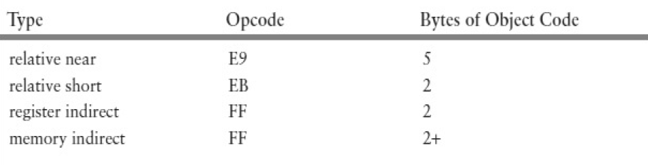

# Unconditional Jumps

The 80x86 jmp (“jump”) instruction corresponds to goto in a
high-level language. 

As coded in assembly language, jmp
usually has the form

```asm

jmp statementLabel

```

where statementLabel corresponds to the name field of some
other assembly language statement.

Recall that the name field
is followed by a colon (:) when used to label an executable
statement. The colon is not used in the jmp instruction itself.

---

* Forward Referencing

```asm
jmp quit
;
; some code
;
quit: mov ax, 0
```

* Backward Referencing

```asm
    mov ax, 0
l:  
    inc ax
    jmp l
    
; infinite loop
```

---

There are several 80x86 jmp instructions. 

All work by
changing the value in the instruction pointer register EIP (RIP
in 64-bit mode) so that the next instruction to be executed
comes from a new address rather than from the address
immediately following the current instruction.

The most
common jump instructions are **relative** jumps that change
the instruction pointer by adding a positive or negative
displacement for a forward or backward reference,
respectively.

There are also **indirect** jumps that get the new
value for the instruction pointer from a register or from
memory.

---
far jumps changes the code segment register as well as
the instruction pointer;
---

* The object code for each relative jump instruction contains the
displacement of the target instruction from the jmp itself. 
    * This displacement is added to the address of the next instruction to
find the address of the target. 
    * The displacement is a signed
number, positive for a forward reference and negative for a
backward reference. 
    * For the relative short version of the
instruction, only a single displacement byte is stored; this is
sign-extended before the addition. 

* The **relative near** format
includes a 32-bit displacement. This is simply added to EIP in
32-bit mode, but is sign-extended before being added to RIP in
64-bit mode.

    

The 8-bit displacement in a relative short jump can serve for a
target statement up to 128 bytes before or 127 bytes after the
jmp instruction.

The 32-bit displacement in a relative near jump instruction
can serve for a target statement up to 2,147,483,648 bytes
before or 2,147,483,647 bytes after the jmp instruction.
