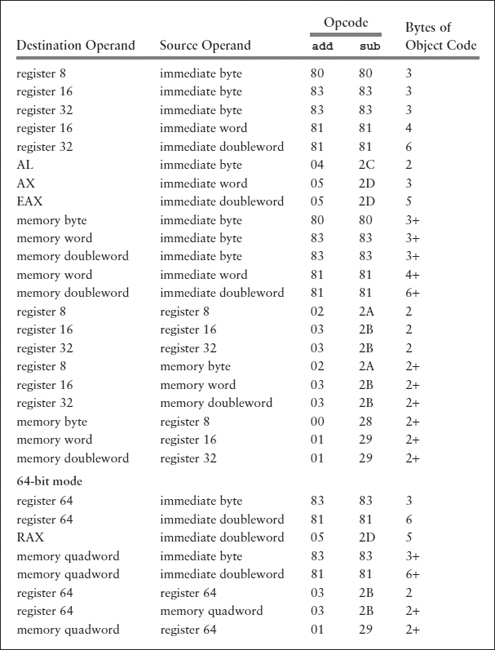

# Conditional Jumps

For example, the instruction

```asm
jz   endWhile
```

means to jump to the statement with label endWhile if the zero flag ZF is set to 1; otherwise, fall through to the next statement. (The mnemonic jz stands for “jump if zero.”)

Conditional jump instructions do not modify the flags; 

they only react to previously set flag values. 

Recall how the flags in the flag register get values in the first place. Some instructions (like mov) leave flags unchanged, some (like add) explicitly set some flags according to the value of a result, and still others (like div) unpredictably alter some flags, leaving them with unknown values.

The terms **set a flag** and **reset a flag** are often used to mean “give the value 1” to a flag and “give the value 0” to a flag, respectively. (Sometimes the word **clear** is used instead of reset.) As you have seen, there are many instructions that set or reset flags. However, a cmp (compare) instruction’s only job is to set or reset flags, and it is probably the most common way to establish flag values.

Each cmp instruction compares two operands and sets or resets AF, CF, OF, PF, SF, and ZF. The only job of a cmp instruction is to fix flag values; this is not just a side effect of some other operation. 

---

```asm
cmp operand1, operand2
```

A cmp executes by calculating operand1 minus operand2, exactly like a sub instruction; the value of the difference and what happens in performing the subtraction determines the flag settings.

A cmp instruction is unlike sub in that the value at the operand1 location is not changed. 

* The flags that are of most interest in this text are CF, OF, SF, and ZF. 
    * The carry flag CF is set if there is a borrow for the subtraction and reset if no borrow is required. 
    * The overflow flag OF is set if there is an overflow and reset otherwise. 
    * The sign flag SF is set if the difference represents a negative 2’s complement number (the leading bit is 1) and is reset if the number is zero or positive.  
    * Finally, the zero flag ZF is set if the difference is zero and is reset if it is nonzero.
 ---
    
 
 
 * What flag values characterize the relations equal, less than, and greater than? Equality is easy; 
    * the ZF flag is set if and only if operand1 has the same value as operand2 no matter whether the numbers are interpreted as signed or unsigned. This is illustrated by Example 1—less than and greater than take more analysis.    
 
 * When you first think about less than, it seems as if the carry flag should be set for a borrow whenever operand1 is less than operand2. This logic is correct if one interprets the operands as unsigned numbers. 
    * Examples 3, 5, 6, and 8 all have operand1 < operand2 as unsigned numbers, and these are exactly the examples where CF=1. 
    * Therefore, for unsigned numbers, CF=0 means operand1 ≥ operand2. 
    * Strict greater-than inequality for unsigned numbers is characterized by CF=0 and ZF=0, that is, operand1 ≥ operand2 and operand1 ≠ operand2.

--- 
 
The cmp instructions are listed in Figure. Looking back at table for sub instructions, you see that the entries in the various columns are almost all the same as for sub instructions. 

* Cmp Instructions

    

* Sub Instructions

    
    
---


---

If the value is unsigned, one might code

```asm
cmp   eax, 100

ja    bigger
```

The jump would be chosen for any value bigger than 0000006416, including values between 8000000016 and FFFFFFFF16, that represents both large unsigned numbers and all negative 2’s complement numbers. If the value in EAX is interpreted as signed, then the instructions

```asm
cmp   eax,100

jg    bigger
```
are appropriate. The jump will only be taken for values between 00000065 and 7FFFFFFF, not for those bit patterns that represent negative 2’s complement numbers.
    