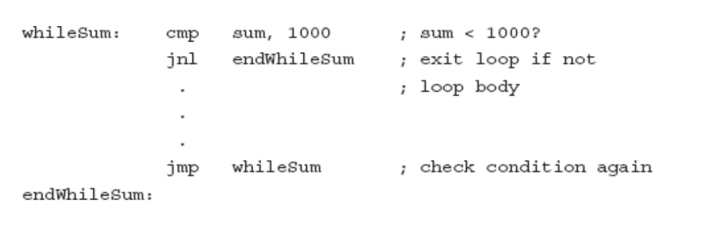

# Loop Structures

* A while loop is a **pretest loop**—the continuation condition, a Boolean expression, is checked first; if it is true, then the body of the loop is executed. The continuation condition is then checked again. Whenever the value of the Boolean expression is false, execution continues with the statement following end while.
    

---
### While 

while (sum < 1000) loop

. . . { loop body }

end while;

---

### Repeat Until

repeat

. . . { loop body }

until termination condition;

---

