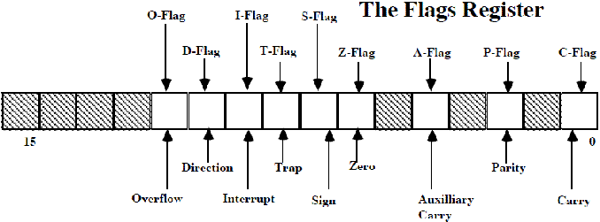

# Registers

## General Purpose Registers
8086 CPU has 8 general purpose registers, each register has its own name: 

* **AX - the accumulator register** ( Divided Into AH / AL ):
    
    * Generates shortest machine code
    
    * Arithmetic, logic and data transfer
    
    * One number must be in AL or AX
    
    * Multiplication & Division
    
    * Input & Output
     

* **BX - the base address register** (divided into BH / BL).
 
* **CX - the count register** (divided into CH / CL):
    
    * Iterative code segments using the LOOP instruction
    
    * Repetitive operations on strings with the REP command
    
    * Count (in CL) of bits to shift and rotate
 

* **DX - the data register** (divided into DH / DL):
    
    * DX:AX concatenated into 32-bit register for some MUL and DIV operations
    
    * Specifying ports in some IN and OUT operations
 
* **SI - source index register**:
    
    * Can be used for pointer addressing of data
    
    * Used as source in some string processing instructions
    
    * Offset address relative to DS
 
* **DI - destination index register**:
    
    * Can be used for pointer addressing of data
    
    * Used as destination in some string processing instructions
    
    * Offset address relative to ES
 
* **BP - base pointer**:

    * Primarily used to access parameters passed via the stack
 
    * Offset address relative to SS
 
* **SP - stack pointer**:
    * Always points to top item on the stack
    * Offset address relative to SS
    * Always points to word (byte at even address)
    * An empty stack will had SP = FFFEh
    
## Segment Registers

* CS - points at the segment containing the current program.

* DS - generally points at segment where variables are defined.

* ES - extra segment register, it's up to a coder to define its usage.

* SS - points at the segment containing the stack.

Although it is possible to store any data in the segment registers, this is never a good idea.

The segment registers have a very special purpose - pointing at accessible blocks of memory. 

* Segment registers work together with general purpose register to access any memory value.     

    * For example if we would like to access memory at the physical address 12345h (hexadecimal), 
        * we should set the DS = 1230h and SI = 0045h.
    
    * This is good, since this way we can access much more memory than with a single register that is limited to 16 bit values.
    
    * CPU makes a calculation of physical address by multiplying the segment register by 10h and adding general purpose register to it (1230h * 10h + 45h = 12345h):

* The address formed with 2 registers is called an **effective address**. 

* By default BX, SI and DI registers work with DS segment register;
* BP and SP work with SS segment register.
* Other general purpose registers cannot form an effective address! 
* Also, although BX can form an effective address, BH and BL cannot! 

## Special Purpose Registers

* **IP - the instruction pointer**:
    * Always points to next instruction to be executed
    * Offset address relative to CS

IP register always works together with CS segment register and it points to currently executing instruction.

## Flags Register

* **Flags Register** - determines the current state of the processor.

* Flags Register is modified automatically by CPU after mathematical operations, this allows to determine the type of the result, and to determine conditions to transfer control to other parts of the program.
Generally you cannot access these registers directly.

 
* **Carry Flag (CF)** - this flag is set to 1 when there is an unsigned overflow. 

    * For example when you add bytes 255 + 1 (result is not in range 0...255). 

    * When there is no overflow this flag is set to 0.
    
* **Parity Flag (PF)** - this flag is set to 1 when there is even number of one bits in result, and to 0 when there is odd number of one bits. 

    * Even if result is a word only 8 low bits are analyzed! 

* **Auxiliary Flag (AF)** - set to 1 when there is an unsigned overflow for low nibble (4 bits).
    * For Example, 11000+11000 = 110000
        * Here D4 ,D3, D2, D1, D0 are respectively 1 1 0 0 0.
        * There is a carry from D3 to D4 in this case.Hence the auxiliary carry flag is set here.
* **Zero Flag (ZF)** - set to 1 when result is zero. 
    
    * For none zero result this flag is set to 0.

* **Sign Flag (SF)** - set to 1 when result is negative. 
 
    * When result is positive it is set to 0. 
 
    * Actually this flag take the value of the most significant bit. 

* **Trap Flag (TF)** - Used for on-chip debugging.

* **Interrupt enable Flag (IF)** - when this flag is set to 1 CPU reacts to interrupts from external devices.

* **Direction Flag (DF)** - this flag is used by some instructions to process data chains,
    * when this flag is set to 0 - the processing is done forward, 
    * when this flag is set to 1 the processing is done backward.

* **Overflow Flag (OF)** - set to 1 when there is a signed overflow. 
    * For example, when you add bytes 100 + 50 (result is not in range -128...127). 
 

## Resources Used
[Inside the 8086 Central Processor Unit (CPU)](https://eclass.upatras.gr/modules/document/file.php/EE649/8086%20Registers.htm)